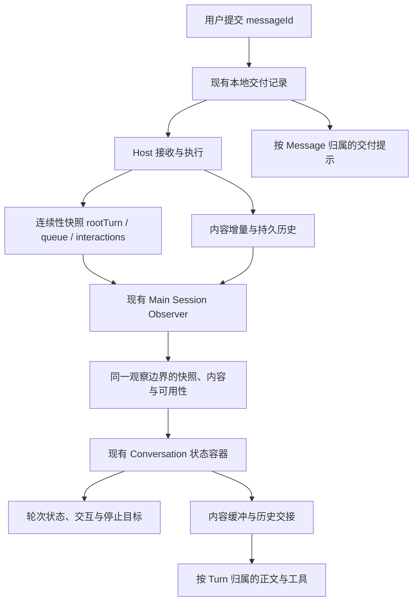

<!--
  Licensed to the Apache Software Foundation (ASF) under one
  or more contributor license agreements.  See the NOTICE file
  distributed with this work for additional information
  regarding copyright ownership.  The ASF licenses this file
  to you under the Apache License, Version 2.0 (the
  "License"); you may not use this file except in compliance
  with the License.  You may obtain a copy of the License at

      http://www.apache.org/licenses/LICENSE-2.0

  Unless required by applicable law or agreed to in writing,
  software distributed under the License is distributed on an
  "AS IS" BASIS, WITHOUT WARRANTIES OR CONDITIONS OF ANY
  KIND, either express or implied.  See the License for the
  specific language governing permissions and limitations
  under the License.
-->

# Desktop 对话：以 Host 投影为唯一执行依据

状态：已实施。主对话、Side Chat、WorkHub 共用 Host 执行投影；内容按 Turn 独立缓冲。本文区分执行事实、命令接收、观察可用性和显示交接。

基线：`12d3fb9332602ec7708cc90b2ffda9fd78dfa491`。范围：主对话、Side Chat、WorkHub 的消息交付、执行状态、观察连接和内容显示。遵循 [Runtime Host 架构](./runtime-host-architecture.md)，不改变 Host 的执行、接收、恢复和持久化权威。

## 问题与决策

发送 B 时，转圈与工作提示可能仍在 A 中。原因不是位置计算，而是 Renderer 缺少当前执行事实，转而从 live 内容、会话目录和历史最后一轮推断归属。

Host 的 `SessionContinuitySnapshot.rootTurn` 已包含 `turnId`、`runId` 和执行状态。Main 收到了这个快照，却主要向 Renderer 转发内容事件及 sessions-changed 通知。普通运行在首条内容到达前，`RuntimeHostSessionProjector.seedActive()` 可以返回空数组；新的 rootTurn 也可以只出现在 `startedTurn` 中，不产生内容事件。

历史上，PR [#3803](https://github.com/apache/maka/pull/3803) 取消普通发送的客户端 Turn 占位，保留了下游旧假设；[#4956](https://github.com/apache/maka/pull/4956) 又引入先本地保存的异步交付。恢复客户端猜测不能解决这个边界问题。

**决策：Renderer 只投影 Host 的执行事实，不维护一套由消息、内容或目录推导的执行生命周期。Main 负责可靠交付这些事实，不代替 Host 作出执行结论。**

“以 Host 为准”不意味着客户端不能保存状态。客户端只能拥有本地交付、观察连接与视觉进度；它们不能证明一个 Turn 已经开始、失败或结束。

## 所有权

| 事实 | 权威 | 客户端能做什么 | 不允许的替代判断 |
|---|---|---|---|
| 尚未送达的 Message、交付结果未知 | 本地 outbox 及该命令的 Host 回执 | 显示、取消尚未派发的消息、查询同一命令 | locally_saved 等于 Turn running |
| Message 接收、队列、所属 Turn | Host Message 接收和连续性投影 | 按 messageId 对应、去重和显示 | 当前可见 Turn、最后一轮或发送时间决定归属 |
| Turn/Run 生命周期 | Host continuity rootTurn；历史终态来自 Host 记录 | 显示当前状态，携带目标身份发命令 | 是否有文本、工具是否结束、目录是否空闲决定终态 |
| 观察是否可用 | 现有 Main observer 与连接生命周期 | 标记正在同步、已同步或状态过期 | 断线、订阅异常等于执行失败 |
| 内容显示到哪里 | Renderer 内容缓冲 | 动画、折叠、等待持久内容接管 | 动画结束等于 Turn complete |

这些是责任划分，不要求增加五个服务或五套状态机。

## 数据链路

### Host 到 Main

沿用已有 `SessionContinuitySnapshot`、订阅顺序及 Host epoch，不增加 turn-started 类展示事件，也不修改 Runtime Event Log 来适配 Desktop。

Host projector 继续为内容、交互和现有 CLI 消费者提供适配。它返回的事件列表不是执行状态快照；Desktop 必须同时消费已接收的连续性事实。不能为了传递 rootTurn 删除整个公共 projector。

### Main 到 Renderer

扩展现有 Session observer 的交付契约，使同一观察范围交付三类信息：

- 已接收的 `rootTurn` 和观察可用性，以 `host_execution` 在现有 Session 事件通道交付。直接复用协议 `TurnSnapshot`；Host epoch 和 revision 的接纳由既有 Main owner/replica 完成，不向 Renderer 透传无人消费的水位。queue、interactions 沿原有投影路径交付，不再复制一份。
- 内容事件，保留其 Turn/Message/Step 归属，沿既有观察范围交付。内容缓冲不决定当前 Run；历史补交和当前增量按消息身份与 offset 去重。
- 观察可用性与错误，不伪装为 Runtime 的 error/abort/complete。

这是现有观察流的完整化，不新增独立快照轮询器或第二条 Host 订阅。接口在 Desktop shared/preload 边界统一转换；UI 只接收其需要的展示字段，避免让 UI 包依赖 Desktop 或执行实现。

初始快照、增量更新、重连替换遵循同一个交付规则：

1. 绑定现有目标身份和订阅；preload 在请求初始结果前安装接收端。
2. Main 的既有 subscription owner 和 replica 负责水位、重连和范围检查；Renderer 不增加第二套订阅序列状态机。
3. 执行快照只经观察事件通道交付，初始 invoke 回包不写执行状态。回包中的内容 seed 按原 Turn/Message 身份归并，不覆盖后来轮次的缓冲。
4. preload 沿用目标作用域和 Host profile 筛选，把 Session 身份投影为 Desktop 身份；不靠 event.id 字符串解析恢复身份。
5. 观察失败通过 `host_observation_error` 进入观察错误回调，不进入 Runtime reducer。pending 将最后快照标记为不可用，停止工作动画并保留最后停止目标；新的已接纳快照恢复观察事实。
6. 释放会话观察时同步撤销快照可用性，保留原 Turn 内容供再次打开时交接。目录不替观察订阅清理内容，也不能让已撤销的观察继续驱动侧栏脉冲。

尚未取得快照与快照明确 `rootTurn:null` 是两个不同事实，不能都编码成 undefined/false 后再靠目录补猜。断线保留的上次快照必须标记过期。

### Renderer

在现有 Conversation/session UI 容器中接纳快照。Main/preload 完成范围与顺序检查，Renderer 不自己推进 admitted → running → completed。

共享纯展示投影从快照和对应内容计算 UI；主对话、Side Chat、WorkHub 使用同一个规则。保留各领域的命令、未知结果恢复和资源关闭职责，不合并成一个全能 controller。

Desktop 传输类型只声明消息形状；跨功能的纯执行投影由 application/contracts 提供。Conversation 拥有状态选择，Shell 合并订阅执行与低频内容摘要，正文独立订阅内容缓冲，不重复订阅同一执行事实。

普通 Enter 提交 `next_turn`，显式插话提交 `current_turn`。Host 在空闲时立即启动普通消息，在运行时将它排入下一轮；Renderer 不根据有无执行快照改写这份意图。首发建会话、修订和要求精确执行的 orchestration 保留各自准备约束，不以新增 `auto` 协议或等待快照的状态机替代已有接纳职责。

Shell 订阅低频执行与交付信息，正文订阅高频内容。会话目录仍服务导航列表和跨会话汇总，不再负责活动对话的执行判定与 live buffer 终止。

## 生命周期与显示行为

| 输入事实 | 显示和动作 |
|---|---|
| 本地 saved/sending，Host 未确认 | 在 Message 行显示交付状态。没有 Turn 身份就不创建执行占位。 |
| 交付 unknown | 保留同一 messageId 和不可变命令，查询 Host；不自动重发成新执行。 |
| Host 接收进队列 | 队列拥有该消息的待处理展示，本地副本不再生成第二行。 |
| Host admitted/created | 对应 Turn 显示已接收或准备状态；没有内容也有明确归属。 |
| Host running | 对应 Turn 显示运行状态；有明确工具事实则显示工具活动。文本为空不证明正在等待模型。 |
| Host waiting_for_user | 显示该轮次已有交互请求，不用通用工作提示掩盖等待用户。 |
| Host providerRetry/context_compact | 投影其已有具体状态，不从是否收到 token 推断。 |
| Host completed/failed/cancelled | 结束该 Run 的执行展示与控制资格。内容缓冲可以继续视觉交接。 |
| 观察断开或失败 | 快照标记不可用，暂停工作动画并保留最后已知停止目标；不制造终态或发送执行结束通知。 |

停止和取消仍是命令：本地取消只影响尚未派发的消息；停止已接收执行携带 Host 确认的目标身份，沿用现有命令的匹配校验。响应未知时保留请求结果未知，不能把 Stop 按钮已点击当成执行已结束。断线后的命令恢复也不得静默改指新 Turn。

### 新旧轮次交接

A 的缓冲与 B 的执行可同时存在。缓冲由原 Turn/Message/Step 身份拥有，B 的快照不能覆盖 A 尚未交接的内容，A 的终态也不能压制 B 的运行提示。

展示规则只有一套：

- 已知 Turn 身份时，同一 TurnView 容纳活动投影及随后到达的历史；以该 Turn 身份保持节点稳定，不建立第二套“实时 Turn”组件。
- 历史尚未装入不影响运行归属。可以仅投影该 Turn 的状态占位；不得伪造 StoredMessage。
- 未绑定 Message 留在消息交付区域；Host 回执、查询或历史明确绑定后才归组，不根据 rootTurn 恰好最新就绑定。
- `LiveTurnBuffer` 保存多轮内容，事件只更新所属 Turn，旧轮次的终态只清理其交互请求。终态内容在对应 durable assistant/tool 证据到达后释放；不增加任意容量、LRU 或过期时间。
- Run 身份继续由 Host 执行快照与停止命令管理，内容步骤不决定控制资格。
- 保留已有的消息等待时长显示，但只关联明确绑定的消息。`rootTurn` 当前不提供运行开始时间，不能把消息时间声称为精确 Run 执行时长；没有对应时间时只显示状态文字。

## 删除与保留

| 现有机制 | 目标处理 |
|---|---|
| ChatView 的 tailTurnId 历史末尾兜底、未绑定消息自动嵌入 | 删除。归属来自明确身份。 |
| runningStatus 布尔值作为轮次执行契约 | 删除。由已接收的轮次投影产生展示状态。 |
| liveTurn.terminal 否决整个会话运行显示 | 删除。终态只约束对应执行，缓冲关闭只约束内容。 |
| deriveTurnActive 合并 phase 与 catalog 的执行裁决 | 删除此用途。命令待接收与已接收执行分别投影。 |
| 主对话 orchestration 的 MessageId-as-TurnId arm/rebind/disarm | 删除。消息交付记录承担立即反馈。 |
| session catalog 驱动的 live 执行状态清理 | 删除执行裁决用途；保留身份校验和防止过时异步写回的必要能力。 |
| 订阅异常经 Runtime error 结束 live 投影 | 从 Desktop 路径删除。改走观察状态与诊断通道。 |
| Composer processing/continuing 与 transcript 重复的执行提示 | 本设计收敛为轮次内一处执行状态；Composer 保留消息提交、Stop 请求进度和必要操作。删除两套执行等待分类及计时传递。 |
| LiveTurnProjection 的内容累计、截断、脱敏和历史交接 | 保留并缩小为内容职责；terminal/complete 若保护缓冲交接仍可保留，但不裁决执行。 |
| Side Chat/WorkHub 的真实命令接收记录 | 保留其 pending/unknown/拒绝/停止恢复；不再用它们代替 Host 执行快照。 |
| outbox、Host queue、epoch fencing、历史读取、局部 selector | 保留各自需求，不为统一而合并。 |

涉及的现有扩展点：

- [Session continuity 协议](../../packages/runtime-host/src/protocol/session-continuity.ts)与[Turn 快照](../../packages/runtime-host/src/protocol/turn.ts)：复用权威事实。
- [Main observer](../../apps/desktop/src/main/runtime-host-session-observer.ts)、[preload](../../apps/desktop/src/preload/preload.ts)：完整、带范围地交付。
- [Conversation 状态](../../apps/desktop/src/renderer/features/conversation/model/session-ui-state.ts)、[shell 状态](../../apps/desktop/src/renderer/use-shell-live-turn.ts)：接纳并选择投影。
- [ChatView](../../packages/ui/src/chat-view.tsx)、[多轮缓冲](../../packages/ui/src/live-turn-buffer.ts)、[内容投影](../../packages/ui/src/live-turn-projection.ts)：身份归属与视觉交接。

## 收敛约束

不建立长期新旧模式，不添加 feature flag，不在快照缺失时退回 tail/catalog/phase 推断。运行中无法观测时显示未知或待同步，不能用错误确定性填补空白。

以可独立验证的完整意图交付：先让现有观察边界可靠交付快照和观察状态；随后在同一消费迁移中覆盖三个对话表面并移除旧执行推断；最后移除已失去消费者的 arm、等待分类与清理用途。中间提交不能把两套推断同时暴露为正式权威，也不能宣称桥接存在就已修复产品。

不改变持久消息格式、Host wire epoch 或公共 CLI 事件适配来完成 Desktop 展示迁移。确实发现现有协议缺少某项产品事实时，应单独证明缺口；禁止为方便 Renderer 新造执行事实。

## 最小验收与消融

| 场景 | 必须观察到的行为 |
|---|---|
| A 已完成，B 提交至首 token | B 提示不进入 A；无需先有内容事件才认识 B。 |
| A 视觉交接未完，B 已开始 | A 输出保留，运行状态和 Stop 目标属于 B。 |
| 首 token 前重连；初始回包晚于更新 | 识别真实活动 Turn；晚回包不恢复旧轮次或旧状态。 |
| 断线、订阅失败、Host 重启 | 只显示观察不可用；Host 事实到达后再投影终态或恢复的新 Run。 |
| steering/follow-up、unknown、拒绝与重试 | 同一 messageId 无重复行、无伪 Turn、无未知结果自动新执行。 |
| 工具、审批、重试、compaction、取消 | 展示对应 Host 事实；不由文本是否为空决定执行生命周期。 |
| 切换任务、Side Chat、WorkHub 浮动/隐藏 | 旧回调与显示进度不改变新范围的执行归属；领域资源关闭仍有效。 |

自动化信号应穿过实际 Main→preload→Conversation 消费边界，并包含空内容快照、交付乱序和旧范围回调。组件测试只保留新旧轮次归属及视觉交接等最小高价值保护；删除退出路径的伪 arm 自证测试。真实 Desktop 必须验证普通发送和至少一个重连交接场景；仅注入 armed liveTurn 的 fixture 不能作为验收。

完成设计或实现时执行消融：删除 tail fallback、catalog 执行推断、普通提交 arm 和重复等待分类后，上述场景仍应成立；若必须恢复其中任何一项，先定位缺失的 Host 事实或交付保证，不把旧推断作为最终补丁。反过来移除 epoch/旧回调保护、outbox 或内容交接会破坏明确验收，因此保留。
