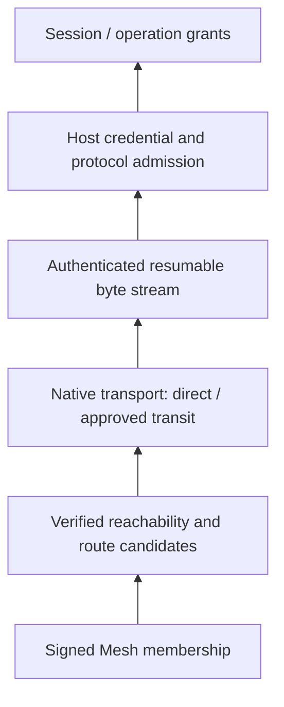

<!--
  Licensed to the Apache Software Foundation (ASF) under one
  or more contributor license agreements.  See the NOTICE file
  distributed with this work for additional information
  regarding copyright ownership.  The ASF licenses this file
  to you under the Apache License, Version 2.0 (the
  "License"); you may not use this file except in compliance
  with the License.  You may obtain a copy of the License at

      http://www.apache.org/licenses/LICENSE-2.0

  Unless required by applicable law or agreed to in writing,
  software distributed under the License is distributed on an
  "AS IS" BASIS, WITHOUT WARRANTIES OR CONDITIONS OF ANY
  KIND, either express or implied.  See the License for the
  specific language governing permissions and limitations
  under the License.
-->

[中文](./peer-mesh-architecture.zh-CN.md)

# Peer Mesh architecture

## 1. Architecture contract and scope

This document answers: **How does Maka retain verifiable Peer relationships as endpoint addresses and network paths change, and provide recoverable connections to the Host protocol?** It defines identity, membership state, address evidence, path admission, and recovery boundaries for networking, Client, and Host integration developers.

The implementation baseline is `09c73430c` (2026-09-09). This describes the current experimental Peer implementation, not future cross-device workflows discussed in blogs. See [Runtime Host architecture](./runtime-host-architecture.md) for execution, permissions, and storage contracts.

Peer Mesh supplies durable private membership, verified reachability exchange, and connection candidates derived from that evidence. Native Peer transport supplies authenticated streams. Neither is a general VPN, Host credential authority, distributed State Root, or cross-Host scheduler. Standalone Direct Peer connections can also use explicit connection information without first joining a Mesh.

Read the layers from bottom to top. An arrow means that a lower layer supplies a capability, not that it grants the upper layer's permissions.



## 2. Components and persistence boundaries

| Component | Owned state/transitions | Output |
|---|---|---|
| Native endpoint | Peer identity, libp2p connections, hole punching, streams and transport quotas | Authenticated peer streams and connectivity/reachability snapshots |
| `RuntimeHostPeerEndpointOwner` | Process lifetime for one endpoint data root, native client and publisher | Endpoint protected by a file-lifetime owner |
| Reachability publisher | Local signed lease revisions, address sets and refresh | Verifiable address evidence |
| `PeerMeshNode` / Mesh store | Mesh authority, signed rosters, invitations, member advertisements, received reachability | Membership view, route resolution and transit policy |
| `RuntimeHostPeerClient` | TS/native bridge, target-bound connect attempts and candidate updates | Application or mesh-control stream |
| `ResumablePeerStream` | Process-local byte offsets, ACKs, attachment generations and recovery window | Logical byte stream retained across path changes |
| Host peer listener | Credential/principal admission, resume attachment validation and quotas | Connection to the common Host dispatcher |
| Desktop reconnect owner | Host/Guest target lifecycle, backoff and current failure diagnostic | Ready/reconnecting/unavailable state |

A PeerId belongs to a network endpoint, not necessarily one physical machine. Desktop Client and Host endpoints may have different identities. Network keys, Mesh authority keys, Host credentials, rootId, and HostEpoch are not interchangeable.

Identity, membership, invitations/advertisements/reachability, and required recovery evidence persist. Active sockets, dial Promises, ACK windows, and stream attachments are process-local. Retaining connection information does not persist a resumable live connection.

Implementation: [endpoint owner](../../packages/runtime-host/src/peer-reachability/owner.ts), [Mesh owner](../../packages/runtime-host/src/peer-mesh/owner.ts), [Mesh node](../../packages/runtime-host/src/peer-mesh/node.ts), [native bridge](../../packages/runtime-host/src/transport/peer-native.ts), [native engine](../../native/runtime-host-peer/src/engine.rs).

## 3. Identity, membership, and discovery data

### 3.1 Three signed facts

| Fact | Signer and principal content | Establishes |
|---|---|---|
| Mesh roster | Mesh authority key; meshId, authorityPeerId, revision, members, closed | Who belongs to this Mesh |
| Member advertisement | Member identity; meshId, peerId, revision, endpointKind, displayName, offersTransit | Announced endpoint role, display metadata and willingness to forward |
| Reachability lease | Corresponding Peer identity; peerId, revision, issuedAt/expiresAt, direct/coordination routes | Which Peer published the address evidence and its validity window |

Mesh ID is bound to the authority key. That signing role differs from the PeerId carrying connections. Membership changes require authority acceptance and propagation of a new roster. A working connection cannot add members, and an IP or relay observation cannot sign reachability on behalf of the target.

Advertisements carry limited networking/endpoint metadata. There is currently no Mesh service catalog for models, GPUs, tools, or work capacity. `endpointKind: host` is not Host operation authorization, and `offersTransit` is not a bearer token for unrestricted relay use.

### 3.2 Membership lifecycle

Creating a Mesh establishes its authority and initial roster. Invitations have validity and count limits. A joiner verifies the invitation and authority, completes the join protocol, and retains signed membership. Member removal or Mesh closure produces a new authority revision. Control streams exchange verified state and reconcile updates; an offline member returning with an old roster cannot undo newer decisions already received.

The authority controls membership changes; application bytes do not all have to traverse it. Authority unavailability may prevent new joins or member changes. Valid paths and Host grants between existing members are separate questions.

Removal recomputes discovery/transit eligibility for the affected Mesh. Leaving one Mesh does not automatically revoke every Host Session grant, nor erase another effective shared Mesh. The corresponding authority owns each authorization withdrawal.

Implementation: [signed models](../../packages/runtime-host/src/peer-mesh/model.ts), [Mesh protocol](../../packages/runtime-host/src/protocol/peer-mesh.ts), [membership coordination](../../packages/runtime-host/src/peer-mesh/node.ts).

## 4. Reachability is evidence, not a permanent locator

Signed leases validate peer identity, revision, time bounds, and route shape. Receipt establishes validity using a monotonic clock. Receiving the same revision/signature again cannot extend its useful lifetime, and wall-clock rollback cannot make old evidence permanently current.

The current default lease lifetime is 5 minutes, maximum accepted lifetime 10 minutes, and clock-skew allowance 2 minutes. Expired records may remain recovery hints within a 24-hour recovery horizon. Current evidence and historical information worth trying for recovery are different. These are implementation limits, not permanent external service commitments.

Nodes can obtain fresh signed information through reachable members, existing addresses/coordination peers, and retained hints. Reconciliation performs bounded exchange and convergence; it does not replicate Host business state or turn repeated notifications into new facts.

If all old addresses, mutually reachable members, and coordination entry points disappear, a PeerId can verify whom a connection reaches but cannot derive a new address. Fresh invitation/connection information or a reachable entry point is then required. Membership may remain durable while route resolution becomes `exhausted`; these states are compatible.

Implementation: [reachability model](../../packages/runtime-host/src/peer-reachability/model.ts), [publisher](../../packages/runtime-host/src/peer-reachability/publisher.ts), [route recovery](../../packages/runtime-host/src/peer-mesh/node.ts).

## 5. Path classes and forwarding admission

| Path | Purpose | Authority/lifetime |
|---|---|---|
| Direct | Carry streams directly between target Peers | Verify the actual remote PeerId; network paths may change |
| Coordination relay | Assist discovery, connection establishment and hole-punch signaling | Public coordination does not confer application transit eligibility |
| Approved Mesh transit | One-hop forwarding by a member satisfying current Mesh eligibility and forwarding policy | Requires membership, advertisements and local admission policy; end-to-end authentication/encryption remain |

A node offers transit only after explicitly selecting a Mesh for that service; forwarding is disabled by default. Client approved-relay sets derive from verified Mesh evidence and policy. Native application protocols check whether the particular connection is direct or uses an approved transit relay. An existing Circuit Relay v2 connection alone does not authorize sending Host application traffic through a public coordination relay.

Transit has reservation, circuit, per-peer, byte, and duration limits. It promises neither unlimited bandwidth nor arbitrary recursive multi-hop gateways. A relay can observe network relationships and traffic characteristics and affect availability; it gains no endpoint Host credential authority and does not process plaintext Session content.

Automatic relay discovery finds public coordination candidates for the current native libp2p path. Retained relay anchors help recovery but are not a guaranteed Maka central directory. Explicit coordination configuration changes the source of that dependency; it does not eliminate the need for reachable third parties under restrictive NATs.

Implementation: [transit policy](../../packages/runtime-host/src/peer-mesh/node.ts), [native application admission](../../native/runtime-host-peer/src/engine/application_stream.rs), [relay discovery](../../native/runtime-host-peer/src/engine/relay_discovery.rs), [native limits](../../native/runtime-host-peer/src/engine.rs).

## 6. Direct transport, WebRTC, and connection attempts

The native endpoint's application PeerId is shared across its libp2p transports. QUIC, TCP/Noise/Yamux, DCUtR, and optional WebRTC provide paths under that identity. Auxiliary relay discovery may have its own internal Swarm; one application identity does not mean exactly one Swarm object in the process.

WebRTC supplies an additional direct path:

1. An authenticated coordination connection carries `/webrtc-signaling/0.0.1` to exchange SDP and Trickle ICE.
2. STUN discovers server-reflexive ICE addresses; it supplies neither membership, Host credentials, nor Session grants.
3. ICE checks select a usable candidate pair; WebRTC upgrade verifies the expected peer and handshake information.
4. The resulting direct connection for that Peer enters the same application admission boundary.

DCUtR and WebRTC signaling are different protocols. DCUtR coordinates libp2p direct hole punching; it does not convert relay-observed TCP/QUIC addresses into WebRTC ICE candidates. At the native options boundary, omitting WebRTC configuration disables that path. An empty STUN list uses no external STUN and does not guarantee discovery of a NAT-external address. This is not a general TURN fallback service.

A connect attempt fixes its target PeerId and request identity, collects/updates candidates, and has a deadline and cancellation. Direct paths are preferred; approved transit can join after a short delay, and stream opening may use bounded hedging. Current transit fallback and hedge delays are both 250 ms, with at most two parallel stream opens. Racing happens at connection/stream establishment; losers close after selection. The same business mutation is never sent in parallel to race responses.

`available` means candidates or an existing connection are present. It proves neither that the target is currently online nor that Host credentials will be accepted.

Implementation: [Peer client](../../packages/runtime-host/src/client/peer-client.ts), [engine](../../native/runtime-host-peer/src/engine.rs), [WebRTC signaling](../../native/runtime-host-peer/src/webrtc_direct/signaling.rs), [WebRTC upgrade](../../native/runtime-host-peer/src/webrtc_direct/upgrade.rs).

## 7. Separate route-resolution and reconnect state machines

### 7.1 Route state

| `RuntimeHostPeerRouteResolution.state` | Meaning | Consumer behavior |
|---|---|---|
| `available` | Candidates exist or the Peer is connected | Connection may be attempted, without a success guarantee |
| `recovering` | Preparation is underway or recovery sources remain | Await bounded recovery and accept candidate updates |
| `exhausted` | The current sweep found no candidates or further recovery basis | End this attempt with `peer_reachability_needs_repair` |

`PeerMeshNode.prepareRoutes()` changes recovery state when a sweep begins and ends even if candidates remain empty. These changes are progress within one attempt, not external triggers for the next retry.

### 7.2 Connection lifecycle

An active dial subscribes to complete route resolution so it can update candidates or cancel on exhaustion. The outer reconnect owner receives only actual availability signals, such as a changed nonempty candidate set or restored Peer connectivity. Losing the last candidate, duplicate candidates, and self-induced `recovering`/`exhausted` transitions do not wake the outer retry.

Combining these subscription contracts would let a failed sweep wake itself and bypass backoff. Reconnect retains independent bounded exponential backoff; fresh route evidence can wake it early. `peer_reachability_needs_repair` describes the current path, not permanent credential revocation. Explicit authentication/compatibility failures or native endpoint termination follow their own terminal contracts.

Desktop maintains one current diagnostic per continuous outage: failed-attempt count, first/last failure times, and latest error. It logs the start and successful recovery, not every alternating dial error. Guest state changes cannot invalidate Owner new-task catalogs. UI `needs_repair`, connection `reconnecting`, and effective Session grants are three independent judgments.

Implementation: [Mesh route notifications](../../packages/runtime-host/src/peer-mesh/node.ts), [filtered reconnect notification](../../packages/runtime-host/src/client/peer-client.ts), [reconnect lifecycle](../../packages/runtime-host/src/client/reconnect-lifecycle.ts), [Desktop owner](../../apps/desktop/src/main/runtime-host-desktop-manager.ts).

## 8. Path recovery and logical byte streams

`ResumablePeerStream` maintains a process-local reliable byte stream between two surviving endpoints: send/receive offsets, ACKs, a finite retransmission window, and attachment generations. On physical path loss or upgrade, a new attachment uses the same logical stream session identity, discards duplicate bytes, and retransmits unacknowledged data.

For resume, the Host listener revalidates credentials, principal kind/ID, credential ID, actual remote PeerId, and session/generation/offset. An old attachment cannot replace a newer one. Revoked authority cannot survive through resume. If the original session is absent, resume is rejected instead of silently creating another Host connection for the old bytes.

The current window is 2 MiB, chunks are 64 KiB, and recovery lasts at most 30 seconds. Retransmission within the ACK window is not business idempotency; the stream neither interprets nor replays Host requests. FIN/FIN_ACK and cancellation/close have distinct convergence paths. Normal completion must not be treated as a recoverable network failure.

Process exit, recovery timeout, or lost retained state ends the logical stream. The upper layer establishes a new Host connection, rechecks root/composition/HostEpoch, and rebuilds subscriptions. Unknown outcomes of dispatched commands remain a Domain reconciliation problem; byte deduplication cannot become exactly-once execution across process restarts.

Implementation: [resumable stream](../../packages/runtime-host/src/transport/resumable-peer-stream.ts), [Host peer listener](../../packages/runtime-host/src/server/peer-listener.ts), [Host connection](../../packages/runtime-host/src/client/connection.ts).

## 9. Host and Session authorization

A connection must satisfy successive boundaries, not select one of them:

```text
Peer identity / path admission
    -> Host credential verification
    -> root and protocol/composition checks
    -> connection principal and explicit operation grants
    -> specific Session grant / Domain admission
```

A Mesh invitation permits joining a Mesh, an Owner connection code configures Host access, and a Session collaboration invitation grants limited access to a particular shared Session. They are not interchangeable invitation formats. Clients may retain multiple network relationships and independent Guest mounts without importing membership into the Owner profile list.

Guest mount disconnection must be distinguished from credential rejection or Session access failure. Disconnection retains access data for recovery. Access failure removes or blocks shared content according to the durable decision. Network unreachability must not revoke credentials, and restored networking cannot undo an effective rejection.

Mesh control traffic owns neither Host Sessions, Runs, Project filesystems, nor Client Capabilities. Even a future network service catalog would still require independent provider binding, policy, and effect admission. Cross-Host delegation would still require durable work identity, results, and cancellation protocols.

Implementation: [access authority](../../packages/runtime-host/src/server/access-authority.ts), [collaboration protocol](../../packages/runtime-host/src/protocol/session-collaboration.ts), [Guest mounts](../../apps/desktop/src/main/runtime-host-guest-session-mounts.ts), [Host architecture](./runtime-host-architecture.md).

## 10. Resource budgets and failure model

Limits belong to separate authorities rather than one global connection count. Representative values at the verified baseline follow; changes must consider decoders, native policy, and contract tests together.

| Scope | Current limit/constraint | Prevents |
|---|---|---|
| Mesh membership | 64 members per Mesh; 16 local Meshes | Unbounded membership and state merging |
| Mesh control | 128 KiB frames; 32 active streams, 2 per Peer | Unbounded control-plane memory/concurrency |
| Host peer admission | 16 pending authentications; 256 streams, 160 per Peer, 4 per principal | Unauthenticated or single-principal Host exhaustion |
| Native transit | 32 reservations, 8 circuits, 2 circuits per Peer | A member exhausting forwarding slots |
| One transit circuit | 2 hours, 256 MiB | Unbounded forwarding time/bandwidth |
| Resumable stream | 2 MiB window, 64 KiB chunks, 30-second recovery | Unlimited buffering and indefinite suspension |

Capacity exhaustion is a resource error, not proof of invalid credentials. Tightening quotas or failing Peer transport cannot silently change grants. Data and control planes have their own budgets; timeout, cancellation, and close release the associated resources.

| Failure | Required invariant |
|---|---|
| Expired/replayed address lease | Do not extend freshness; use only as recovery evidence within the allowed horizon |
| Unavailable authority | Do not fabricate membership changes; assess existing data paths independently |
| Public coordination works but direct fails | Do not promote the public relay to application transit |
| Approved relay disappears | Select another eligible path or fail; do not expand the relay allowlist |
| Peer connected but credential revoked | Reject Host admission/resume and close affected streams |
| Repeated empty route recovery | Preserve backoff, mounts and current diagnostics; await actual new evidence |
| Physical stream breaks | Bounded byte resume; then new connection/Domain recovery beyond that boundary |
| Native endpoint process terminates | Do not resurrect process-local streams; follow endpoint/Client lifecycle recovery |
| Every locator disappears | Require fresh evidence; do not promise lookup from PeerId alone |

Implementation: [Mesh limits](../../packages/runtime-host/src/peer-mesh/limits.ts), [Mesh control](../../packages/runtime-host/src/peer-mesh/node.ts), [native limits](../../native/runtime-host-peer/src/engine.rs), [Host quotas](../../packages/runtime-host/src/server/peer-listener.ts).

## 11. Trade-offs and extension boundaries

| Choice | Reason | Cost/non-guarantee |
|---|---|---|
| Separate identity, membership and locators | Address changes preserve identity; network relationships do not expand permissions | Durable membership cannot guarantee reachability |
| One roster-signing Mesh authority | Membership changes have an explicit issuer and revision | Control is limited while authority is offline; not leaderless consensus |
| Separate public coordination and private transit | Reuse public hole-punch infrastructure while restricting application carriers | Some NATs cannot connect without direct paths or eligible transit |
| One logical connect attempt with bounded internal races | Improve path selection without copying business requests | Requires loser cancellation, concurrency limits and candidate update checks |
| Process-local stream resume | Isolate brief path changes from the Host protocol | Does not solve Host restarts, effect idempotency or state replication |
| Outage diagnostic snapshots | Offline retries do not consume log capacity | Retains current summaries rather than every dial's full trace |

The current system does not provide a general VPN, reachability through arbitrary NATs, a permanent global PeerId directory, general TURN relaying, a Mesh model/tool/compute catalog, a cross-Host scheduler, or multi-writer State Roots. Future business protocols can build on networking, but must define their own authorities, durable intent, permissions, and failure semantics. They are not implicit capabilities of membership or byte streams.

## 12. Implementation and verification entry points

| Contract | Test entry point |
|---|---|
| Signed rosters, membership, transit and locator recovery | [peer-mesh](../../packages/runtime-host/src/__tests__/peer-mesh.test.ts) |
| Lease freshness, receipts and recovery horizon | [peer-reachability](../../packages/runtime-host/src/__tests__/peer-reachability.test.ts) |
| Candidate changes, empty recovery sweeps and native bridge | [peer-native](../../packages/runtime-host/src/__tests__/peer-native.test.ts) |
| Byte offsets, resume, deduplication and close | [resumable-peer-stream](../../packages/runtime-host/src/__tests__/resumable-peer-stream.test.ts) |
| Host credentials, resume identity and quotas | [peer-listener](../../packages/runtime-host/src/__tests__/peer-listener.test.ts) |
| Guest grants and Peer access | [peer-session-collaboration](../../packages/runtime-host/src/__tests__/peer-session-collaboration.test.ts) |
| Guest/Owner recovery isolation and outage summaries | [Desktop manager](../../apps/desktop/src/main/__tests__/runtime-host-desktop-manager.test.ts), [preload catalog](../../apps/desktop/src/main/__tests__/runtime-host-new-task-preload.test.ts), [copied diagnostics](../../apps/desktop/src/main/__tests__/main-process-diagnostics.test.ts) |
| Native application path policy | [application stream tests](../../native/runtime-host-peer/src/engine/application_stream.rs) |
| WebRTC upgrade | [WebRTC tests](../../native/runtime-host-peer/src/webrtc_direct/tests.rs) |

Tests verify protocol and state-machine contracts, not availability across every real NAT, public relay, network transition, and OS. Product reachability validation additionally needs actual paths, Peer identities, deployment configuration, and network conditions. A local success cannot establish global reliability.
