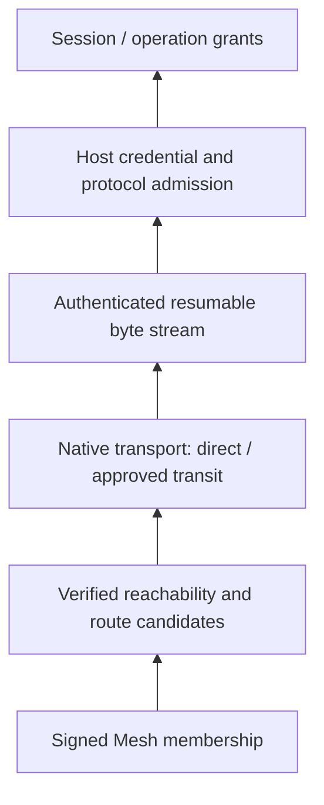

<!--
  Licensed to the Apache Software Foundation (ASF) under one
  or more contributor license agreements.  See the NOTICE file
  distributed with this work for additional information
  regarding copyright ownership.  The ASF licenses this file
  to you under the Apache License, Version 2.0 (the
  "License"); you may not use this file except in compliance
  with the License.  You may obtain a copy of the License at

      http://www.apache.org/licenses/LICENSE-2.0

  Unless required by applicable law or agreed to in writing,
  software distributed under the License is distributed on an
  "AS IS" BASIS, WITHOUT WARRANTIES OR CONDITIONS OF ANY
  KIND, either express or implied.  See the License for the
  specific language governing permissions and limitations
  under the License.
-->

[English](./peer-mesh-architecture.md)

# Peer Mesh 架构

## 1. 架构契约与范围

本文回答：**Maka 如何在端点地址和网络路径变化时，维持可验证的 Peer 关系，并为上层 Host 协议提供可恢复的连接？** 面向网络、Client 与 Host 接入层开发者，定义身份、成员状态、地址证据、路径准入和恢复边界。

实现基线为 `09c73430c`（2026-09-09）。本文描述当前实验性 Peer 实现，不把博客中的未来跨设备工作形态当成已经存在的协议。Host 执行、权限与存储契约见 [Runtime Host 架构](./runtime-host-architecture.zh-CN.md)。

Peer Mesh 提供持久的私有成员关系、受验证的 reachability 交换，以及基于这些事实生成的连接候选。Native Peer transport 提供认证过的 stream。两者不是通用 VPN、Host credential authority、分布式 State Root 或跨 Host scheduler。独立 Direct Peer 连接也可通过显式连接信息建立，不要求先加入 Mesh。

下面按层从下向上读取；箭头表示下层提供能力，不表示下层授予上层权限。



## 2. 组件与持久化边界

| 组件 | 拥有的状态/转换 | 输出 |
|---|---|---|
| Native endpoint | Peer identity、libp2p 连接、打洞、stream 与 transport quota | 已认证 peer stream、connectivity/reachability snapshot |
| `RuntimeHostPeerEndpointOwner` | 同一 endpoint data root 的进程生命周期、native client 和 publisher | 一个受文件生命周期 owner 保护的 endpoint |
| Reachability publisher | 本地签名 lease 的 revision、地址集合与刷新 | 可验证的地址证据 |
| `PeerMeshNode` / Mesh store | Mesh authority、签名 roster、邀请、member advertisements、收到的 reachability | 成员视图、route resolution、transit policy |
| `RuntimeHostPeerClient` | TS/native bridge、目标绑定的 connect attempt、候选更新 | application 或 mesh-control stream |
| `ResumablePeerStream` | 进程内 byte offsets、ACK、attachment generation、恢复窗口 | 路径变化时保留的逻辑字节流 |
| Host peer listener | credential/principal 准入、resume attachment 校验和 quota | 进入通用 Host dispatcher 的连接 |
| Desktop reconnect owner | Host/Guest 目标生命周期、退避、当前故障诊断 | Ready/reconnecting/unavailable 状态 |

PeerId 属于网络 endpoint，不必与一台物理机器一一对应。Desktop Client endpoint 与 Host endpoint 可以有不同身份。Network key、Mesh authority key、Host credential、rootId 和 HostEpoch 不能互换。

持久化保留 identity、membership、invitation/advertisement/reachability 及必要的恢复证据；活动 socket、拨号 Promise、ACK window 和 stream attachment 是进程内状态。保存了连接信息不意味着已经保存了一个可继续的运行中连接。

实现：[endpoint owner](../../packages/runtime-host/src/peer-reachability/owner.ts)、[Mesh owner](../../packages/runtime-host/src/peer-mesh/owner.ts)、[Mesh node](../../packages/runtime-host/src/peer-mesh/node.ts)、[native bridge](../../packages/runtime-host/src/transport/peer-native.ts)、[native engine](../../native/runtime-host-peer/src/engine.rs)。

## 3. 身份、成员关系与发现信息

### 3.1 三种签名事实

| 事实 | 签发者与关键内容 | 证明什么 |
|---|---|---|
| Mesh roster | Mesh authority key；meshId、authorityPeerId、revision、members、closed | 谁属于这个 Mesh |
| Member advertisement | Member identity；meshId、peerId、revision、endpointKind、displayName、offersTransit | 成员公布的端点角色、显示信息和转发意愿 |
| Reachability lease | 对应 Peer identity；peerId、revision、issuedAt/expiresAt、direct/coordination routes | 这些地址证据由哪个 Peer 发布及其有效窗口 |

Mesh ID 与 authority key 绑定。Authority 的签名角色不同于实际承载连接的 PeerId；成员修改要通过 authority 接受并传播新的 roster。有效连接并不能自行增加成员，IP 或 relay 观察到某个地址也不能替目标签发 reachability。

Advertisement 是有限的网络/端点元数据。当前没有模型、GPU、工具或工作容量的 Mesh 服务目录；`endpointKind: host` 不是 Host 操作授权，`offersTransit` 也不是允许任意人使用 relay 的 bearer token。

### 3.2 成员生命周期

创建 Mesh 建立 authority 与初始 roster；邀请有有效期和数量限制。加入者验证 invitation 与 authority，完成加入协议并保留签名 membership。移除成员或关闭 Mesh 产生新的 authority revision。节点通过控制 stream 交换已验证状态并协调更新；离线成员稍后恢复时不能仅靠旧 roster 撤销已经收到的新决定。

Authority 是成员变更的控制点，不要求所有 application bytes 都经 authority 中转。Authority 离线可能阻止新的加入或成员修改，但已有成员间的有效路径和 Host grants 是不同问题。

移除成员会重新计算相关 Mesh 的发现/transit 资格。不能把“离开一个 Mesh”自动翻译为“撤销所有 Host Session grants”，也不能忽略另一个仍有效的共享 Mesh。授权回收由对应的 authority 执行。

实现：[signed models](../../packages/runtime-host/src/peer-mesh/model.ts)、[Mesh protocol](../../packages/runtime-host/src/protocol/peer-mesh.ts)、[membership coordination](../../packages/runtime-host/src/peer-mesh/node.ts)。

## 4. Reachability：地址证据不是永久定位器

签名 lease 校验 peer identity、revision、时间边界和 route shape。收到 lease 后建立基于单调时钟的有效期 receipt；再次收到同一 revision/signature 不延长它的有效生命，wall-clock 回拨也不能让旧证据永久有效。

当前 lease 默认有效 5 分钟，接受的最大生命周期为 10 分钟，允许的时钟偏差为 2 分钟。过期记录在 24 小时 recovery horizon 内仍可作为恢复线索；“可用证据”和“可以尝试恢复的历史线索”不等价。这些是当前实现限额，不是外部可依赖的永久服务承诺。

节点可通过仍可达的成员、已有地址/协调节点及保存的线索获取新的签名信息。Reconcile 负责有界交换与收敛，不复制 Host 的业务状态，也不把重复通知变成新的事实。

若所有旧地址、共同在线成员和可用协调入口都消失，知道 PeerId 只能验证找到的是谁，不能推导它的新地址。此时需要新的 invitation/连接信息或重新出现的可达入口。Membership 可以长期保留，而 route resolution 进入 `exhausted`；两者不矛盾。

实现：[reachability model](../../packages/runtime-host/src/peer-reachability/model.ts)、[publisher](../../packages/runtime-host/src/peer-reachability/publisher.ts)、[route recovery](../../packages/runtime-host/src/peer-mesh/node.ts)。

## 5. 路径类别与转发准入

| 路径 | 用途 | 授权/生命周期 |
|---|---|---|
| Direct | 在目标 Peer 间直接承载 stream | 验证实际远端 PeerId；网络路径可变化 |
| Coordination relay | 协助发现、连接建立和打洞信令 | 公共协调节点不因此获得 application transit 资格 |
| Approved Mesh transit | 由符合当前 Mesh 资格和转发策略的成员提供一跳中转 | 同时满足 membership、advertisement 与本地准入策略；端到端认证/加密保留 |

节点只有显式选择提供 transit 的 Mesh 后才提供这类服务，默认不转发。客户端的 approved relay 集合来自验证后的 Mesh 证据与 policy。Native application protocol 检查具体连接是否 direct 或经过受认可的 transit relay；不能因为某条 Circuit Relay v2 连接已经存在，就在公共协调 relay 上发送 Host application traffic。

Transit 有 reservation、circuit、per-peer、字节和时间上限，不是无限带宽承诺，也不递归构建任意多跳网关。Relay 可观察网络连接与流量特征、影响可用性；它不取得端点的 Host credential authority，也不成为明文 Session 的处理者。

Automatic relay discovery 为当前 native libp2p 路径发现公共协调候选；保存 relay anchors 有助于后续恢复，但不是保证可用的 Maka 中央目录。配置明确的协调入口可以改变依赖来源，无法消除受限 NAT 下对可达第三方的需要。

实现：[transit policy](../../packages/runtime-host/src/peer-mesh/node.ts)、[native application admission](../../native/runtime-host-peer/src/engine/application_stream.rs)、[relay discovery](../../native/runtime-host-peer/src/engine/relay_discovery.rs)、[native limits](../../native/runtime-host-peer/src/engine.rs)。

## 6. Direct transport、WebRTC 与连接尝试

Native endpoint 的 application PeerId 统一用于 libp2p transport；QUIC、TCP/Noise/Yamux、DCUtR 和可选 WebRTC 在这一身份下提供连接路径。辅助 relay discovery 可以有自己的内部 Swarm，不能把“一份 application identity”理解为进程中只有一个 Swarm 对象。

WebRTC 是额外的 direct path：

1. 已认证的协调连接承载 `/webrtc-signaling/0.0.1`，交换 SDP 和 Trickle ICE。
2. STUN 用于发现 server-reflexive ICE 地址；它不提供 membership、Host credential 或 Session grant。
3. ICE 检查选择可用 candidate pair，WebRTC upgrade 验证预期 peer 与握手信息。
4. 成功得到可用于目标 Peer 的 direct connection，再进入相同的 application admission。

DCUtR 与 WebRTC signaling 是不同协议。前者协调 libp2p 直连打洞，不把 relay 观察到的 TCP/QUIC 地址自动转换成 WebRTC ICE candidates。在 native options 边界，没有提供 WebRTC 参数时路径关闭；提供空 STUN 列表时不使用外部 STUN，不能保证获得 NAT 外部地址。当前不是通用 TURN fallback 服务。

一个 connect attempt 固定目标 PeerId 和 request identity，收集/更新候选，带 deadline 与取消。Direct 优先，approved transit 可在短延迟后加入；stream-open 可做有界 hedge。当前 transit fallback 与 hedge 延迟均为 250 ms，最多两个并行 stream opens。竞争发生在连接/stream 建立层，选出结果后关闭其他尝试，绝不并行发送同一个业务 mutation 来竞争响应。

`available` 只说明有候选或已有连接，不证明目标当前在线，更不证明 Host credential 可用。

实现：[Peer client](../../packages/runtime-host/src/client/peer-client.ts)、[engine](../../native/runtime-host-peer/src/engine.rs)、[WebRTC signaling](../../native/runtime-host-peer/src/webrtc_direct/signaling.rs)、[WebRTC upgrade](../../native/runtime-host-peer/src/webrtc_direct/upgrade.rs)。

## 7. Route resolution 与 reconnect 的两个状态机

### 7.1 路由状态

| `RuntimeHostPeerRouteResolution.state` | 含义 | 消费者行为 |
|---|---|---|
| `available` | 存在候选，或 Peer 已连接 | 可尝试建连，不保证成功 |
| `recovering` | 正在准备或仍有恢复来源 | 等待有界恢复，接受候选更新 |
| `exhausted` | 当前检查无候选且没有继续恢复的依据 | 结束本次尝试，返回 `peer_reachability_needs_repair` |

`PeerMeshNode.prepareRoutes()` 会在检查开始/结束时改变恢复状态，即使前后都没有任何候选。这些变化是一次尝试的进度，不能充当下一次重试的外部触发。

### 7.2 连接生命周期

正在进行的 dial 订阅完整 route resolution，以便更新候选或在 exhausted 时取消。外层 reconnect owner 只接收“候选变为不同的非空集合”或“Peer 连接恢复”等实际可用性信号。最后一个候选消失、重复候选、以及 `recovering`/`exhausted` 自身切换都不唤醒外层重试。

这两个订阅契约不能合并：否则一次失败的检查会唤醒自己、跳过 backoff。Reconnect 保留独立的有界指数退避；新的路由证据可提前唤醒。`peer_reachability_needs_repair` 是当前路径状态，不是永久撤销 credential 的证据。明确的认证/兼容性或 native endpoint 终止错误，按自己的 terminal contract 处理。

Desktop 对一个持续断线周期只保留一个当前诊断：失败次数、首次/最近时间和最新错误。开始和成功恢复各记录一条日志，重试中的错误交替不逐次追加。Guest 状态更新不能作废 Owner 新任务 catalog。UI 的 `needs_repair`、连接 `reconnecting` 和 Session grant 是否有效是三个独立判断。

实现：[Mesh route notifications](../../packages/runtime-host/src/peer-mesh/node.ts)、[filtered reconnect notification](../../packages/runtime-host/src/client/peer-client.ts)、[reconnect lifecycle](../../packages/runtime-host/src/client/reconnect-lifecycle.ts)、[Desktop owner](../../apps/desktop/src/main/runtime-host-desktop-manager.ts)。

## 8. 路径恢复与逻辑字节流

`ResumablePeerStream` 在两个仍存活的 endpoint 之间维持进程内可靠字节流：发送 offset、接收 offset、ACK、有限重传 window 和 attachment generation。物理路径中断或升级时，以相同 logical stream session identity 建立新 attachment，去除重复 bytes 并补发未确认部分。

Host listener 对 resume 再验证 credential、principal kind/ID、credential ID、实际远端 PeerId，以及 session/generation/offset。旧 attachment 不能覆盖新 attachment；authority 已撤销时不能通过 resume 继续使用旧权限。找不到原 session 时拒绝 resume，不能悄悄创建另一个 Host connection 来承接旧 bytes。

当前 window 为 2 MiB、chunk 为 64 KiB、恢复窗口为 30 秒。ACK window 内的重传不是业务幂等层；stream 不解析也不重放 Host requests。FIN/FIN_ACK 与取消/关闭有独立收敛路径，正常结束不能被当成需要恢复的网络故障。

当进程退出、恢复窗口耗尽或 retained stream state 不存在时，逻辑 stream 结束。上层建立新的 Host connection，重新校验 root/composition/HostEpoch 并重建 subscription。已发送 command 的未知结果仍交给 Domain 协调；byte dedup 不能扩展成跨进程 exactly-once 执行。

实现：[resumable stream](../../packages/runtime-host/src/transport/resumable-peer-stream.ts)、[Host peer listener](../../packages/runtime-host/src/server/peer-listener.ts)、[Host connection](../../packages/runtime-host/src/client/connection.ts)。

## 9. Host 与 Session 授权边界

建立连接需要逐层满足，而不是任选一项：

```text
Peer identity / 路径准入
    -> Host credential 验证
    -> root 与 protocol/composition 校验
    -> connection principal 和显式 operation grants
    -> 具体 Session grant / Domain admission
```

Mesh invitation 授予加入 Mesh 的机会，Host Owner connection code 配置 Host 访问，Session collaboration invitation 授予特定共享 Session 的受限访问；三者不是同一种邀请码。Client 可以保留多个网络关系和独立的 Guest mounts，不能把 membership 自动导入 Owner profile 列表。

Guest mount 的离线状态与 credential rejection / Session access failure 必须区分。前者保留授权数据等待恢复；后者按持久访问决定清理或拒绝继续展示。网络不可达不应触发 credential revocation，网络重新连通也不能撤销已经生效的拒绝。

Mesh control traffic 不拥有 Host 的 Session、Run、Project filesystem 或 Client Capability。即使将来增加网络服务发现，实际 capability 调用仍需独立的 provider binding、policy 与 effect admission；跨 Host delegation 仍需持久的工作身份、结果与取消协议。

实现：[access authority](../../packages/runtime-host/src/server/access-authority.ts)、[collaboration protocol](../../packages/runtime-host/src/protocol/session-collaboration.ts)、[Guest mounts](../../apps/desktop/src/main/runtime-host-guest-session-mounts.ts)、[Host architecture](./runtime-host-architecture.zh-CN.md)。

## 10. 资源预算与故障模型

限额按不同 authority 分层，不能仅靠一个全局 connection count。以下为所验证基线的代表值，修改时同时检查 decoder、native policy 和契约测试：

| 范围 | 当前限额/约束 | 防止的失控 |
|---|---|---|
| Mesh membership | 每 Mesh 64 members；本地最多 16 Meshes | 无界成员和状态合并 |
| Mesh control | 128 KiB frame；32 active streams、每 Peer 2 个 | 控制面内存/并发失控 |
| Host peer admission | 16 pending authentications；256 streams、每 Peer 160、每 principal 4 | 尚未授权或单一 principal 占满 Host |
| Native transit | 32 reservations、8 circuits、每 Peer 2 circuits | 一个成员耗尽转发槽位 |
| 单 transit circuit | 2 小时、256 MiB | 无界转发时间与带宽 |
| Resumable stream | 2 MiB window、64 KiB chunk、30 秒恢复 | 无限缓存与永久悬挂 |

容量不足是资源错误，不是 credential 无效的证明。收紧配额或让 Peer transport 失败不能偷偷改变 grants。数据面和控制面使用各自的 budget，超时、取消和关闭需要释放对应资源。

| 故障 | 必须保持的性质 |
|---|---|
| Address lease 过期/重放 | 不延长 freshness；在允许的 horizon 内仅作为恢复线索 |
| Authority 离线 | 不伪造成员变更；已有成员的数据路径独立判断 |
| Public coordination relay 可用但 direct 失败 | 不自动把公共 relay 变成 application transit |
| Approved relay 丢失 | 重新选择合格路径或失败；不能扩大 relay allowlist |
| Peer 已连接但 credential 被撤销 | Host 拒绝新 admission/resume，清理受影响 stream |
| 路由恢复反复无结果 | 正常退避，保留 mount 与当前诊断，等待真实新证据 |
| 物理 stream 中断 | 有界 byte resume；超过边界后交给新连接/Domain recovery |
| Native endpoint 进程终止 | 不能复活进程内 stream；按 endpoint/Client 生命周期恢复 |
| 所有定位入口消失 | 明确需要新线索；不承诺只凭 PeerId 可以找到目标 |

实现：[Mesh limits](../../packages/runtime-host/src/peer-mesh/limits.ts)、[Mesh control](../../packages/runtime-host/src/peer-mesh/node.ts)、[native limits](../../native/runtime-host-peer/src/engine.rs)、[Host quotas](../../packages/runtime-host/src/server/peer-listener.ts)。

## 11. 设计取舍与扩展边界

| 选择 | 理由 | 代价/不能推出的结论 |
|---|---|---|
| Identity、membership、locator 分开 | 地址变化不改变成员身份，网络关系不自动扩权 | 持久 membership 不能保证目标可达 |
| 一个 Mesh authority 签 roster | 成员变更有明确签发者与 revision | Authority 离线时控制面受限；不是无 leader 共识系统 |
| 公共 coordination 与私有 transit 分开 | 可利用公共打洞基础设施，同时限制谁承载 application traffic | 某些 NAT 下没有 direct 或合格 transit 就不能连接 |
| 一个逻辑 connect attempt，内部有限竞争 | 改善路径选择而不复制业务请求 | 需要取消 loser、限制并行与检查候选更新 |
| 进程内 stream resume | 隔离短暂路径变化与 Host 协议 | 不解决 Host 重启、业务 effect 幂等或状态复制 |
| Outage diagnostic snapshot | 离线重试不侵占日志容量 | 诊断保留当前概要，不保留每次拨号的完整轨迹 |

当前不提供通用 VPN、任意 NAT 的必达保证、全网永久 PeerId 目录、通用 TURN relay、Mesh 模型/工具/算力目录、跨 Host scheduler 或多写 State Root。未来可以基于网络层建立这些业务协议，但必须另行定义 authority、durable intent、权限和 failure semantics，不能把它们当成 membership 或 byte stream 的隐含能力。

## 12. 实现与验证入口

| 契约 | 测试入口 |
|---|---|
| 签名 roster、membership、transit 与 locator 恢复 | [peer-mesh](../../packages/runtime-host/src/__tests__/peer-mesh.test.ts) |
| Lease freshness、receipt 与 recovery horizon | [peer-reachability](../../packages/runtime-host/src/__tests__/peer-reachability.test.ts) |
| 候选变化、空恢复检查与 native bridge | [peer-native](../../packages/runtime-host/src/__tests__/peer-native.test.ts) |
| Byte offset、resume、去重与关闭 | [resumable-peer-stream](../../packages/runtime-host/src/__tests__/resumable-peer-stream.test.ts) |
| Host credential、resume 身份与 quota | [peer-listener](../../packages/runtime-host/src/__tests__/peer-listener.test.ts) |
| Guest grant 与 Peer 接入 | [peer-session-collaboration](../../packages/runtime-host/src/__tests__/peer-session-collaboration.test.ts) |
| Guest/Owner 恢复隔离与断线汇总 | [Desktop manager](../../apps/desktop/src/main/__tests__/runtime-host-desktop-manager.test.ts)、[preload catalog](../../apps/desktop/src/main/__tests__/runtime-host-new-task-preload.test.ts)、[copied diagnostics](../../apps/desktop/src/main/__tests__/main-process-diagnostics.test.ts) |
| Native application path policy | [application stream tests](../../native/runtime-host-peer/src/engine/application_stream.rs) |
| WebRTC upgrade | [WebRTC tests](../../native/runtime-host-peer/src/webrtc_direct/tests.rs) |

测试能验证协议和状态机契约，不能证明所有真实 NAT、公共 relay、网络切换与 OS 组合都可用。验证产品可达性时需要额外记录实际路径、Peer 身份、部署配置和网络条件；不能从一个局部成功推导全网可靠性。
