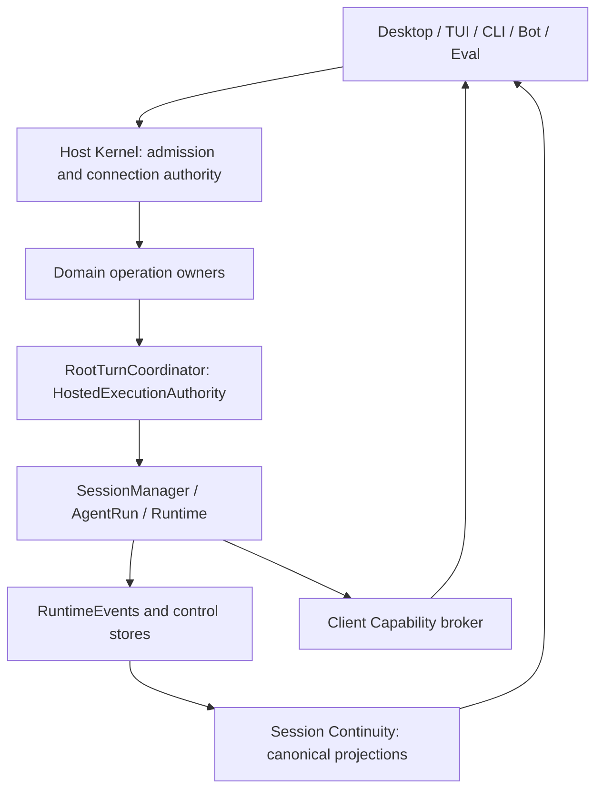
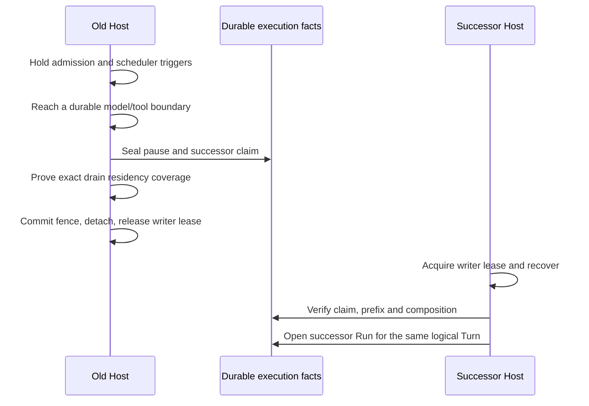

<!--
  Licensed to the Apache Software Foundation (ASF) under one
  or more contributor license agreements.  See the NOTICE file
  distributed with this work for additional information
  regarding copyright ownership.  The ASF licenses this file
  to you under the Apache License, Version 2.0 (the
  "License"); you may not use this file except in compliance
  with the License.  You may obtain a copy of the License at

      http://www.apache.org/licenses/LICENSE-2.0

  Unless required by applicable law or agreed to in writing,
  software distributed under the License is distributed on an
  "AS IS" BASIS, WITHOUT WARRANTIES OR CONDITIONS OF ANY
  KIND, either express or implied.  See the License for the
  specific language governing permissions and limitations
  under the License.
-->

[中文](./runtime-host-architecture.zh-CN.md)

# Runtime Host architecture

## 1. Architecture contract and scope

This document answers: **How do multiple entry points and connections share execution in one State Root while preserving ownership across concurrency, disconnection, process exit, and upgrades?** It specifies component responsibilities, persistence boundaries, state transitions, and failure semantics for developers maintaining the Host, extending a Domain, or implementing a Client.

The implementation baseline is `09c73430c` (2026-09-09). Unless explicitly marked historical or unsupported, statements describe that baseline's current implementation; Peer functionality remains experimental. Linked schemas, implementation, and tests own protocol fields and resource limits. See [Peer Mesh architecture](./peer-mesh-architecture.md) for networking and [Runtime resume](./runtime-resume-architecture.md) for execution recovery algorithms.

A State Root has at most one writer Host at a time. Desktop, TUI, CLI, Bot, and Eval are entry points or adapters; they do not create another Runtime owning the same work. Execution control, business decisions, storage, and observation remain separate responsibilities inside the Host. Calling the Host an authority does not give its Kernel authority to interpret every business state.

Read the diagram from Client downward. It describes calls and ownership boundaries, not a mandatory path through every node for every request. Transports, deployment, and the full Domain inventory are omitted.



## 2. Authorities and identities

### 2.1 Ownership boundaries

| Authority | Decides | Does not decide |
|---|---|---|
| Storage Root owner | Which process may write this root | Client permissions, installed version, business success |
| Host Kernel | Connection admission, request routing, process retention, drain and close | Turn semantics, model selection, scheduling policy |
| Host Composition | Fixed dependency graph, Module set, recovery and close order | Runtime plugin discovery, dynamic per-Session configuration |
| Domain Module | Its operation semantics, business state, recovery policy | Starting a second Runtime outside shared root admission |
| `RootTurnCoordinator` | Implements `HostedExecutionAuthority`: admit, stop, and recover a Session's root execution | How a Goal or Scheduled Task interprets its result |
| Runtime / AgentRun | Model and tool steps, events, execution and continuation | Discovery, the Client's default Host, installation management |
| Session Continuity | Snapshots, transcripts, and live projections from canonical facts | Inferring completion from notifications or resending Client commands |
| Client Capability | Provider selection, bounded reverse calls and uncertain outcomes | Transferring Session/Run ownership to a Client |
| Deployment owner | Service configuration, installation, activation and replacement coordination | Acquiring the State Root writer lease from an installation record |

`hosted-execution-coordinator.ts` and `hosted-execution-runner.ts` coordinate/adapt external execution calls; `RootTurnCoordinator` is the actual shared root authority. New entry points reuse the public execution contract rather than creating an execution owner based on a filename.

### 2.2 Identities are not interchangeable

| Identity | Scope and meaning | Changes when |
|---|---|---|
| `rootId` | Durable State Root identity; Host identity in the protocol | Explicit creation, import or repair rules apply; it is not a path string |
| `HostEpoch` | Current Host process instance | The Host process restarts |
| Composition ID | Program composition allowed to interpret the root | Explicit persistent binding changes, not an ordinary upgrade |
| Composition Revision | Composition revision checked by Clients | Composition evolves; this is not merely a diagnostic label |
| Protocol version / compatibility epoch | Wire-contract compatibility | Protocol contracts evolve |
| Host Generation | Runtime version/development generation requested by a local owner | Product upgrade or development launch; separate from protocol version |
| `targetEpoch` | A Desktop connection target's lifecycle generation | Target replacement fences old requests and callbacks |
| Profile ID / incarnation | Client connection configuration and its persistent instance | Configuration replacement, credential and local partition rules apply |
| PeerId | Cryptographic identity of a network endpoint | Network identity keys change; not an IP, rootId or HostEpoch |
| Session / Turn / Run ID | Conversation, logical root work, execution instance | One Turn may span physical Runs after handoff |

Product Session identity is `(rootId, sessionId)`; matching Session IDs do not imply the same work. Lifecycle-scoped Desktop requests also carry `targetEpoch`. This fence excludes stale callbacks and does not replace authentication.

Implementation: [Root authority](../../packages/storage/src/root-authority.ts), [connection handshake](../../packages/runtime-host/src/client/connection.ts), [reconnecting connection](../../packages/runtime-host/src/client/reconnecting-connection.ts), [Desktop identity](../../apps/desktop/src/shared/runtime-host-identity.ts).

## 3. State Root ownership and startup

Root capability acquisition canonicalizes the real path, then validates the root marker's random `rootId` against filesystem object identity. Aliases cannot create another logical owner; copying an initialized directory does not automatically acquire the original root's identity. Import, remount, and repair have separate explicit validation paths. Process-local registration authenticates capabilities and leases; TypeScript types alone are insufficient.

Write authority comes from an OS lock on a stable file. A durable account-local ownership namespace arbitrates by `rootId`, retaining a compatibility lock boundary. Registration files, PIDs, sockets, health probes, and cache directories are discovery or observation data. Removing discovery caches cannot legitimately create a second writer.

Closing a lease rejects new operations, waits for admitted operations, then releases the OS handles. Store facades receive that owner/lease; business code cannot bypass it by opening another database connection. The lock does not prove that every external descendant process exits with the Host.

Startup order is:

1. Acquire and validate the root writer owner.
2. Bind the Composition ID under the write lease; reject incompatibility before listeners or Domain Store writes.
3. Establish listeners and registration, then enter `recovering`. Limited lifecycle information can be available before business readiness.
4. Construct the Composition, install unique operation handlers, and execute recovery phases.
5. Publish `ready` after successful recovery; start optional physical storage maintenance afterward.

Discovering a Host therefore proves only that a candidate process exists. A handshake cannot bypass Kernel readiness or operation permission checks. Maintenance failures back off independently rather than making physical cleanup another business-readiness authority.

Implementation: [State Root composition](../../packages/storage/src/state-root-composition.ts), [Host Kernel](../../packages/runtime-host/src/server/host-kernel.ts), [storage maintenance](../../packages/runtime-host/src/server/storage-maintenance.ts).

## 4. Fixed Composition and Domain lifecycle

The Composition descriptor is selected before listeners start. Modules and dependencies are constructed during startup, with no dynamic registration after Ready. Dependencies are passed directly rather than looked up by Module name. Each business operation has exactly one Module handler; duplicate ownership is a construction error. Process, access, and diagnostic controls remain Kernel-owned.

The Module contract contains `handlers`, `recover(phase)`, `beginDrain()`, `close()`, and optional `releaseConnection()`. A Module can combine coordinators; it is neither a separate process nor necessarily a source-directory boundary.

| Recovery phase | Prerequisite established |
|---|---|
| `state` | Interpretable durable business and control state |
| `resources` | Resource identities and recovery outcomes for retained process/resource records |
| `executions` | Admission, Run, and continuation consistency |
| `domains` | Recovery and execution-result reconciliation for business owners such as Goals and plans |
| `schedulers` | Permission for schedulers to produce work after preceding state is ready |

Close runs in reverse Module construction order. A drain/close failure does not skip other owners; failures are aggregated. Stores close before the writer lease is released. Modules cannot hide external I/O or execution Promises outside lifecycle accounting, because that would prevent the Kernel from proving exit or handoff safety. Drain/close cancellation must also reach starting, queued, or I/O-waiting work and be rechecked after async waits, preventing activation after shutdown begins.

Implementation: [Module contract](../../packages/runtime-host/src/server/host-composition.ts), [interactive assembly](../../packages/runtime-host/src/server/execution-composition.ts).

## 5. Root admission and execution results

### 5.1 Two levels of serialization

`SessionAdmissionGate` provides short per-Session critical sections. Multi-Session operations acquire in a stable order. An explicit lease permits work within an admitted context; implicit nested acquisition is rejected. Execution leaves the admission async context rather than holding this lock throughout model requests.

Above this, `RootTurnCoordinator` manages pending reservations and active execution:

```text
Per Session: at most one logical root execution being admitted or running
Different Sessions: may execute concurrently
Child Sessions / Graph lineage: retain their execution and lineage constraints
```

`prepare()` returns a single-consumption reservation or busy/unavailable. `RootAdmissionOwner` persists the exact execution intent: Session, Turn, Run, user message, source messages, and predecessor chain. Reusing an ID with a different intent is not an acceptable retry. An admission chain whose consistency cannot be proved fails closed.

A `drain` residency is acquired before entering asynchronous admission and remains until execution takes over or admission fails. This closes the exit window in which a request has entered but no active work is yet visible to the Kernel.

### 5.2 Execution handles and durable facts

Successful admission returns that execution's `snapshot`, `completion`, and `settled`:

- `completion` describes completion, failure, cancellation, or an explicit inability to establish authority.
- `settled` signals that execution cleanup has finished.
- A Domain retains the handles returned for this execution instead of reconstructing equivalent handles from a Session ID.

The Promises support different decisions; callback ordering is not another persistence guarantee. Process-local subscriptions are invalidation hints. Lost notifications, reconnection, and recovery require rereading admissions, RuntimeEvents, and control Stores.

Implementation: [Session admission](../../packages/runtime-host/src/server/session-admission-gate.ts), [Root admission](../../packages/runtime-host/src/server/root-admission-owner.ts), [Root execution](../../packages/runtime-host/src/server/root-turn-coordinator.ts), [public execution contract](../../packages/runtime-host/src/server/hosted-execution-authority.ts).

## 6. Model input, tool revisions, and policy activation

`RunComposition` is an immutable C0 baseline for a Run. It records composer/source revisions, hashes of the system prompt/tool catalog/tool availability/provider options, tool names, and context window. It is neither another copy of the complete prompt nor a guarantee that model tools never change during the Run.

The baseline is durably committed before the first real provider dispatch; commit failure prevents the call. Dynamic tool changes belong to `RequestComposition` epochs. Committing C0 must not resample them and silently replace the original baseline. A recovered or handoff successor checks actual input semantics rather than treating matching field shapes as compatibility.

Policy mutations and backend activation serialize through the short `RuntimePolicyActivationGate`. It protects the interval between policy checking and execution activation, not the entire model call. Uncertain policy authority blocks further execution; a stale read projection and a failed authoritative write are different failures.

The Host resolves model catalogs from persistent connection/model configuration and Host metadata, then projects them to Clients. Local Client resolution is limited to cases without authoritative Host state, such as unsaved editor drafts. Display slugs do not replace immutable connection identity.

Implementation: [Run Composition schema](../../packages/core/src/run-composition.ts), [model composition](../../packages/runtime-host/src/server/execution-model-composition.ts), [policy activation](../../packages/runtime-host/src/server/runtime-policy-activation-gate.ts).

## 7. Canonical observation and message delivery

Ordinary Runtime Session transcripts are projected from durable RuntimeEvents. SQL queries locate immutable event ordering; the projector interprets message semantics. A separate message table no longer independently interprets ordinary Run history alongside RuntimeEvents. Historical data still has compatibility conversion paths, while WorkHub Coordination Sessions have their own domain contract and must not be folded into ordinary Run rules.

Opening a Session subscription atomically obtains a canonical snapshot, `nextSeq`, and active stream IDs. The open response is written before subsequent subscription frames. Live sequence belongs to the connection observation protocol; transcript cursors and durable event/message ordinals identify pagination. They are neither one counter nor necessarily consecutive integers.

Larger transcripts use bounded pagination. Cursors bind the subscription, Session, source, direction, and watermark with integrity checks. Bootstrap, pages, per-Turn projection work, and active overlays have separate bounds. Sequence gaps, HostEpoch changes, subscription loss, and invalid cursors require reopening and rereading canonical state. PTY has separate backpressure/subscription boundaries so it cannot overwhelm ordinary Session observation.

For delivery, reconnection does not imply permission to execute a command again. Queries may retry under their read-only contract. A sent command without a received result retains an unknown outcome and reconciles through its Domain's exact request IDs, admission, or result records. Desktop's durable outbox preserves message and attachment identity, restoring crash-time `sending` as `unknown`; this is not generic transport replay.

Implementation: [Session Continuity](../../packages/runtime-host/src/server/session-continuity-coordinator.ts), [transcript reader](../../packages/runtime-host/src/server/session-transcript-reader.ts), [pager](../../packages/runtime-host/src/server/session-transcript-pager.ts), [Desktop local store](../../apps/desktop/src/main/session-local-store.ts), [local service](../../apps/desktop/src/main/session-local-service.ts).

## 8. Transport, authentication, and Client Capability

### 8.1 One public protocol, multiple connection paths

| Path | Connection and trust boundary |
|---|---|
| Local IPC | UDS or Windows pipe; Local Owner is granted after validating the same-user boundary |
| TLS WebSocket | Authenticate before upgrade and recheck on admission; no silent plaintext downgrade |
| SSH tunnel | Explicit operator/Client tunnel followed by the Host protocol; tunnel lifetime belongs to the connection |
| Plaintext WebSocket | Explicitly acknowledged insecure configuration; never automatic TLS fallback |
| Native Peer stream | PeerId verification and end-to-end transport still precede Host credential and protocol admission; not WebSocket |

These paths share operation codecs, dispatch, connection permissions, and canonical state. Frames, inflight operations, writer queues, subscriptions, and reverse calls are bounded. The read pump is independent of async handlers, allowing a reverse-call response to arrive while the Host is handling another request. An ordinary request timeout ends that request's wait; liveness failure closes the connection. They are distinct mechanisms.

A connection's principal, operation grants, and path/capability access are fixed at admission. Credential prepare/finalize, rotation, and revocation follow durable access state; changed authority takes effect through a new connection. Operation sets are explicit, so adding a protocol operation does not expand existing grants. Durable revocation precedes notifications; uncertain commits require conservative fencing.

### 8.2 The reverse-call execution cut

Clients publish versioned, size-limited capability offers. The Host selects bindings by principal, provider instance, contract, and `call`/`turn`/`session` affinity. Losing a session-affine provider cannot silently select another machine, and remote work cannot arbitrarily borrow an unrelated Client's local capabilities.

Reverse calls distinguish:

1. The Host dispatches a call; the provider returns `accepted` evidence.
2. The Host verifies policy/grants and sends `admitted`, authorizing the effect.
3. The provider returns a result; the Host commits it once under the invocation identity.

Disconnection before `admitted` is capability loss; disconnection or timeout afterward may mean an unknown outcome. The tool journal preserves this distinction instead of automatically repeating an uncertain external effect. A Client may execute local UI/MCP capabilities while the Host retains Run, Session, and recovery ownership.

Implementation: [connection session](../../packages/runtime-host/src/server/connection-session.ts), [outbound writer](../../packages/runtime-host/src/server/serial-outbound-writer.ts), [access authority](../../packages/runtime-host/src/server/access-authority.ts), [capability coordinator](../../packages/runtime-host/src/server/client-capability-coordinator.ts), [invocation broker](../../packages/runtime-host/src/server/client-capability-invocation-broker.ts).

## 9. Owner profiles, Guest mounts, and Client-local state

### 9.1 Two access objects

Owner profiles are Client connection configuration. `local` and enabled remote Owner profiles connect independently; a State Root cannot be enabled through multiple Owner profiles. The default Host applies only to new work and operations without an existing Host scope. Changing it neither moves Sessions nor closes other connections. Environment profile deployment/activation information remains separate from Host runtime authority.

A Guest shared task is an independent **Session mount**, excluded from the Owner profile catalog and ineligible as default Host. The mount store owns Guest credentials and retained shared Session projections. One root can have multiple shared Session mounts. Startup migrates/cleans up historical experimental Guest-as-remote-profile data; that legacy representation does not expand current profile authority.

| Operation/state | Owner profile | Guest mount |
|---|---|---|
| New-task Host, Project/model/settings catalogs | Participates, subject to operation permissions | Excluded |
| Shared Session observation | Determined by Host authority | Only projections covered by effective Session grants |
| Shared task input | Normal Domain admission | Exact turn request; Owner decision precedes canonical admission |
| Offline | Retain configuration and recover connection | Retain mount; not equivalent to grant revocation |
| Credential rejection or lost Session access | Connection/permission failure handling | Persist access failure and remove shared state that may no longer be displayed |

Guest observation grants, turn-request grants, Host operation grants, tool sandbox permissions, and Client Capability grants are separate contracts. Mesh membership implies none of them.

### 9.2 Isolation and local persistence

Desktop routes operations and events using `(rootId, sessionId)` and `targetEpoch`. Guest connection changes cannot invalidate Owner new-task catalogs; Owner replacement must still invalidate the old catalog. Local outbox/history caches partition by profile incarnation, root, and credential identity. Cached content grants no live authority; Guests do not reuse the Owner offline-history cache policy.

Client preferences, profiles, Guest mounts, deployment bindings, and outbox have different data owners, none equivalent to the Host operational DB. Reading `runtime-host-deployments.json` may migrate it and therefore requires write exclusion. Current operations use a process-lifetime OS lease. After obtaining single-instance authority and before concurrent store access, Desktop reclaims empty legacy directory locks. Ordinary reads cannot steal a lock based on age, and a failed read cannot be replaced with an empty configuration write.

Implementation: [profile service](../../apps/desktop/src/main/runtime-host-profile-service.ts), [Guest mounts](../../apps/desktop/src/main/runtime-host-guest-session-mounts.ts), [Desktop manager](../../apps/desktop/src/main/runtime-host-desktop-manager.ts), [preload catalogs](../../apps/desktop/src/preload/preload.ts), [deployment bindings](../../apps/desktop/src/main/runtime-host-managed-services.ts), [process-lifetime file lock](../../packages/storage/src/process-lifetime-file-update-lock.ts).

## 10. Host retention, drain, and Client lifetime

Natural idle exit, graceful drain, launcher exit, and operator stop are distinct events.

| Residency | Prevents natural idle exit | Represents active work that drain must await | Typical holder |
|---|---|---|---|
| `idle` | Yes | No | Future Scheduled Tasks, armed/paused Goals, idle Daily Review |
| `drain` | Yes | Yes | Admission, execution, persistence handoff, active resource work |

Natural ephemeral exit requires no accepted connections, in-progress handshakes, active operations, or residencies of either kind. Maintenance/replacement can distinguish idle retention from actual drain work; one total count cannot decide every exit scenario.

An ordinary Client disconnect releases connection-scoped subscriptions, capabilities, and controller leases without automatically cancelling admitted work. Desktop quit first performs bounded retirement preparation for its currently owned ephemeral Host, allowing the Host to recheck activity and close admission under the selected mode. Quit neither waits for process exit nor enables cooperative handoff. An unreachable Host cannot prevent Desktop exit; the launch-owner guard remains responsible for closing its owned Host when launcher IPC is lost. TUI detach, a one-shot CLI's owned invocation, and an operator-managed Service Host follow their respective lifetime contracts. There is consequently no guarantee that work survives closing any arbitrary Client.

The Host owns resource processes. Shell/PTY identity is recorded before spawn; observation and control are separate. Control uses connection/controller identity and ordering constraints. Disconnecting an observer does not terminate the process. Recovery reconciles retained resources using provable OS identity. A PID alone cannot safely authorize termination, nor prove that all escaped descendants ended.

Implementation: [residency registry](../../packages/runtime-host/src/server/host-residency-registry.ts), [Kernel lifecycle](../../packages/runtime-host/src/server/host-kernel.ts), [launcher guard](../../packages/runtime-host/src/candidate-launch-owner-guard.ts), [Desktop quit](../../apps/desktop/src/main/runtime-host-quit.ts), [resource coordinator](../../packages/runtime-host/src/server/runtime-resource-coordinator.ts).

## 11. Cooperative handoff and crash recovery

### 11.1 The irreversible cut

Local upgrades depend on the observed HostEpoch and current activity. Client diagnostic snapshots guide interaction; they do not grant kill authority. The shared handoff flow reobserves its target. Automatic replacement requires provable idleness or supported cooperative handoff; intentionally interrupting work requires the corresponding authorization. Service/installation ownership remains with the deployment owner.

The sequence below describes only successful cooperative handoff. Timeouts, incomplete work coverage, or failed safety checks do not guarantee entry into this path.



`runtime_handoff_pause_v1` records the original root Run, successor Run, invocation/claim, remaining steps, and related facts. Ending the old physical invocation does not record logical Turn termination. The new Run must match the claim, immutable event prefix, lineage, and input semantics.

The Kernel requires exact residency handles from handoff and proof that no other `drain` work was omitted; matching labels or counts are insufficient. No async window may separate the final proof from committing the fence. Before commitment, cancellation can release the hold and resume original work. After the irreversible cut, the transaction must settle; cancellation cannot restart the old Run.

Runtime pauses cooperatively at durable model/tool boundaries. It does not hot-migrate arbitrary provider streams, in-progress external effects, or PTYs. Incompatible prompt, tools, provider options, context window, or sandbox provenance prevents successor model/tool execution.

### 11.2 A crash is not a cooperative pause

Startup validates admissions, source-message proof, and Run identity before fixups or continuation. Admitted work without a Run, an already-started old Run, execution with a valid handoff claim, and safe-boundary continuation follow distinct recovery branches. A continuation with missing safety conditions may be parked; it is not permission to run the work again.

Goals, Scheduled Tasks, and Daily Review persist their own business intent and reconcile against the common execution authority. An armed Goal that never ran must not start merely because the process restarted. A Scheduled Task's pending fire retains exact admission identity. An interaction Promise in the old process cannot be resurrected from disk; a committed answer and a resumable invocation are distinct facts.

Implementation: [Client handoff](../../packages/runtime-host/src/client/host-handoff.ts), [Runtime handoff gate](../../packages/runtime/src/run-handoff-gate.ts), [logical execution](../../packages/core/src/runtime-logical-execution.ts), [root recovery](../../packages/runtime-host/src/server/root-turn-coordinator.ts), [Goal](../../packages/runtime-host/src/server/goal-coordinator.ts), [Scheduled Task](../../packages/runtime-host/src/server/scheduled-task-coordinator.ts).

## 12. Workspace and deployment authority

`WorkspaceTarget` has exactly two forms: `{ kind: "project", projectId }` and `{ kind: "host_path", path }`. The Host resolves the canonical workspace through its Project Catalog or an authorized Host path. Clients do not interpret remote `hostCwd` through their own filesystem. `canUseHostPaths` controls path submission, not path confidentiality.

Remote directory browsing uses Host-published opaque root IDs and validated path segments with realpath containment. Symlinks and Client-local pickers cannot expand that boundary.

Installation and write authority are also separate. An account-local deployment owner coordinates Desktop, CLI, managed service, or development ownership by root identity and CAS revision. The managed deployment document describes configuration and `active`/`transition`/`blocked` recovery states. Service artifacts are projections of that configuration rather than a competing deployment journal.

Updates verify package version/integrity, prepare the target, confirm actual target readiness, and then commit installation state. Retries must recognize an already-successful successor rather than terminating it again from old process information. Ordinary remote credentials do not grant machine operator installation rights; SSH operator activation is a separate explicit boundary.

Implementation: [workspace resolver](../../packages/runtime-host/src/server/workspace-resolver.ts), [local deployment owner](../../packages/runtime-host/src/operator/local-deployment-owner.ts), [managed deployment](../../packages/runtime-host/src/operator/managed-deployment.ts).

## 13. Failure convergence and diagnostics

| Observed failure | Authority and convergence | Invalid inference/action |
|---|---|---|
| Root owner or composition mismatch | Stop business entry and report the actual conflict | Bypass ownership by deleting registration or editing a PID |
| No usable/recoverable Peer route | Networking reports reachability; Client retains backoff and a recovery entry point | Treat it as credential revocation or repeatedly wake itself |
| Identical or alternating reconnect failures | One current outage diagnostic: count, first/last times, latest error; log start and recovery | Append every retry stack and evict other diagnostics |
| HostEpoch or live sequence changes | Reestablish observation and read canonical state | Replay sent mutations to rebuild the UI |
| Guest disconnect | Recover its mount independently | Invalidate Local new-task catalogs or change the default Host |
| Retained Client data-file lock | Recover through proven ownership/OS lease; retain unexpected contents | Steal locks during ordinary reads or overwrite failed reads with empty configuration |
| Unknown command/admitted capability outcome | Reconcile Domain records or retain unknown | Promise exactly-once external effects |
| An owner fails during drain/close | Continue other releases and aggregate errors | Release the writer lease while a Store can still write |

Copied diagnostics can read Desktop's current connection state while the target Host is unreachable, without a remote query. Retry counters do not trigger catalog reloads; changed errors may still update connection state. A successful connection ends the outage summary, and a later failure begins a new one. Diagnostics are redacted and own no retry, recovery, or replacement authority. Host protocol teardown for invalid frames, reused request IDs, quota violations, or writer failure retains one bounded failure diagnostic. This is evidence of an actual connection failure, separate from the Client's routine outage summary.

Implementation: [Desktop diagnostics](../../apps/desktop/src/main/main-process-diagnostics.ts), [Desktop manager](../../apps/desktop/src/main/runtime-host-desktop-manager.ts), [reconnect lifecycle](../../packages/runtime-host/src/client/reconnect-lifecycle.ts).

## 14. Trade-offs and maintenance checks

| Choice | Property obtained | Cost and extension constraint |
|---|---|---|
| One root writer + fixed Composition | One execution/recovery authority and provable close order | Cross-Host work needs explicit protocols, not a shared writable root |
| Short admission + long-lived execution handles | Serialized Session conflicts without holding a lock across model I/O | Every entry point must connect reservations, durable intent, and residency |
| Durable facts + bounded projections | Clients reconnect independently; lost transport does not rewrite history | Requires snapshots/cursors/sequences and reconstruction, not unlimited live-event caching |
| No automatic replay of uncertain effects | Avoids duplicate external side effects | Domains must define confirmation, reconciliation, or manual resolution |
| Cooperative-boundary handoff | Preserves logical Turns while replacing physical Runs | Requires verifiable claims, prefixes, input semantics, and complete work coverage |
| Outage summaries instead of per-retry logs | Long outages do not flood diagnostics; current failure remains inspectable | Does not retain every dial's full history; permanent failures retain their separate error path |

Before changing this design, check for a second writer/execution owner; uninterrupted accounting from admission through cleanup; durable facts versus projections versus Client preferences; confused connection/process/installation generations; duplicate effects after unknown mutation outcomes; and accidental promotion of Guest/network identity to Owner permissions.

These tests are entry points to the contracts, not evidence that every OS, NAT, or deployment combination was tested on hardware:

| Contract | Regression entry points |
|---|---|
| Root ownership, fixed recovery and close | [root-authority](../../packages/storage/src/__tests__/root-authority.test.ts), [host-kernel](../../packages/runtime-host/src/__tests__/host-kernel.test.ts), [host-composition](../../packages/runtime-host/src/__tests__/host-composition.test.ts) |
| Exact admission and execution recovery | [root-admission-owner](../../packages/runtime-host/src/__tests__/root-admission-owner.test.ts), [root-turn-coordinator](../../packages/runtime-host/src/__tests__/root-turn-coordinator.test.ts) |
| Input, observation and capability calls | [execution-model-composition](../../packages/runtime-host/src/__tests__/execution-model-composition.test.ts), [session-continuity](../../packages/runtime-host/src/__tests__/session-continuity-coordinator.test.ts), [client-capability-recovery](../../packages/runtime-host/src/__tests__/client-capability-recovery.test.ts) |
| Upgrade and process retention | [host-handoff](../../packages/runtime-host/src/__tests__/host-handoff.test.ts), [host-residency-registry](../../packages/runtime-host/src/__tests__/host-residency-registry.test.ts) |
| Guest/Local isolation | [guest mounts](../../apps/desktop/src/main/__tests__/runtime-host-guest-session-mounts.test.ts), [new-task preload](../../apps/desktop/src/main/__tests__/runtime-host-new-task-preload.test.ts), [Desktop manager](../../apps/desktop/src/main/__tests__/runtime-host-desktop-manager.test.ts) |
| Client lock recovery and diagnostics | [managed services](../../apps/desktop/src/main/__tests__/runtime-host-managed-services.test.ts), [profile service](../../apps/desktop/src/main/__tests__/runtime-host-profile-service.test.ts), [diagnostics](../../apps/desktop/src/main/__tests__/main-process-diagnostics.test.ts) |
