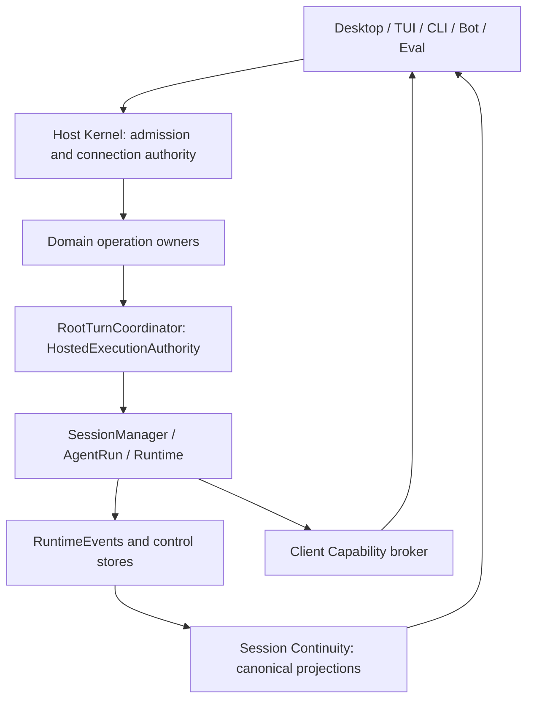
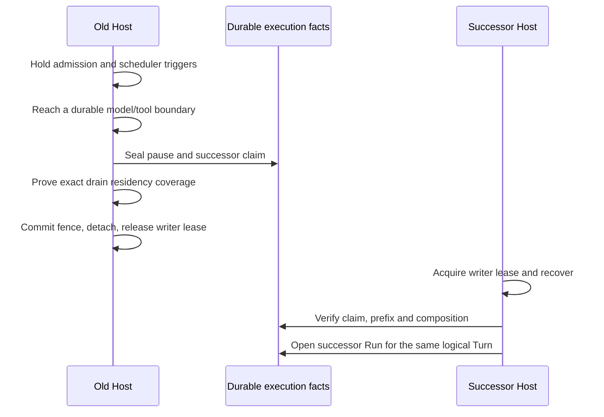

<!--
  Licensed to the Apache Software Foundation (ASF) under one
  or more contributor license agreements.  See the NOTICE file
  distributed with this work for additional information
  regarding copyright ownership.  The ASF licenses this file
  to you under the Apache License, Version 2.0 (the
  "License"); you may not use this file except in compliance
  with the License.  You may obtain a copy of the License at

      http://www.apache.org/licenses/LICENSE-2.0

  Unless required by applicable law or agreed to in writing,
  software distributed under the License is distributed on an
  "AS IS" BASIS, WITHOUT WARRANTIES OR CONDITIONS OF ANY
  KIND, either express or implied.  See the License for the
  specific language governing permissions and limitations
  under the License.
-->

[English](./runtime-host-architecture.md)

# Runtime Host 架构

## 1. 架构契约与范围

本文回答：**多个入口和多个连接如何共享一个 State Root 上的执行，同时在并发、断线、进程退出和升级后保持权责一致？** 面向维护 Host、扩展 Domain 或实现 Client 的开发者，规定组件职责、持久化边界、状态转换和失败语义。

实现基线为 `09c73430c`（2026-09-09）。除明确标为历史或不提供的能力外，下文描述该基线的当前实现；Peer 相关能力仍属实验性功能。协议字段和资源限额以链接的 schema、实现与测试为准。网络层另见 [Peer Mesh 架构](./peer-mesh-architecture.zh-CN.md)，执行恢复算法另见 [Runtime resume](./runtime-resume-architecture.zh-CN.md)。

一个 State Root 同时最多有一个 writer Host。Desktop、TUI、CLI、Bot 与 Eval 是执行入口或适配器，不另建拥有同一份工作状态的 Runtime。Host 进程内部仍分开执行控制、业务决策、存储和观察职责；“Host 是 authority”并不意味着 Kernel 可以解释所有业务状态。

以下图从 Client 向下读取，表示调用与权责边界，不表示每一次请求都经过所有节点，也不展开传输、部署或全部 Domain。



## 2. 权责与标识

### 2.1 Authority 分工

| Authority | 决定什么 | 不决定什么 |
|---|---|---|
| Storage Root owner | 哪个进程可以对这个根执行写操作 | Client 权限、安装版本、业务成功 |
| Host Kernel | 连接准入、请求路由、进程存活、drain 与关闭 | Turn 的业务含义、模型选择、调度策略 |
| Host Composition | 固定依赖图、Module 集合、恢复与关闭顺序 | 运行时插件发现、每个 Session 的动态配置 |
| Domain Module | 自己的操作语义、业务状态和恢复策略 | 绕过统一 root admission 启动另一套 Runtime |
| `RootTurnCoordinator` | 实现 `HostedExecutionAuthority`，准入、停止、恢复一个 Session 的 root execution | Goal 或 Scheduled Task 如何解释执行结果 |
| Runtime / AgentRun | 模型与工具步骤、事件、执行与 continuation | 连接发现、客户端默认 Host、安装管理 |
| Session Continuity | 从 canonical facts 构建 snapshot、transcript 和 live projection | 从通知推断执行已完成，或替 Client 重发命令 |
| Client Capability | 选择 provider、约束 reverse call 及其不确定结果 | 把 Session/Run 所有权转移给 Client |
| Deployment owner | 服务配置、版本安装、激活与替换协调 | 凭安装记录取得 State Root writer lease |

`hosted-execution-coordinator.ts` 和 `hosted-execution-runner.ts` 是面向外部执行调用的协调/适配层；实际的统一 root authority 是 `RootTurnCoordinator`。新增入口应复用公共执行契约，不按文件名另造一个执行 owner。

### 2.2 标识不可互换

| 标识 | 范围与含义 | 变化边界 |
|---|---|---|
| `rootId` | State Root 的持久身份，协议中的 Host identity | 显式创建、导入或修复规则；不是路径字符串 |
| `HostEpoch` | 当前 Host 进程实例 | Host 进程重启 |
| Composition ID | 允许解释这个根的程序组合类型 | 持久绑定，不因普通升级自动改变 |
| Composition Revision | 当前组合修订，Client 会检查 | 组合演进；不只是诊断标签 |
| Protocol version / compatibility epoch | wire contract 兼容性 | 协议契约演进 |
| Host Generation | 本地 owner 请求运行的 Runtime 版本/开发代际 | 产品升级或开发启动；不等同协议版本 |
| `targetEpoch` | Desktop 中某个连接目标的生命周期代际 | 替换目标，隔离旧请求与回调 |
| Profile ID / incarnation | Client 的连接配置及其持久实例 | 配置替换、凭据与本地数据分区规则 |
| PeerId | 网络端点的密码学身份 | 网络身份密钥变化；不是 IP、rootId 或 HostEpoch |
| Session / Turn / Run ID | 会话、逻辑顶层工作、执行实例 | 一个 Turn 在 handoff 后可跨多个物理 Run |

产品中的 Session identity 是 `(rootId, sessionId)`；同名 Session ID 不代表同一份工作。带生命周期的 Desktop 请求还携带 `targetEpoch`。这层 fence 排除旧回调，不能替代认证。

实现：[Root authority](../../packages/storage/src/root-authority.ts)、[connection handshake](../../packages/runtime-host/src/client/connection.ts)、[reconnecting connection](../../packages/runtime-host/src/client/reconnecting-connection.ts)、[Desktop identity](../../apps/desktop/src/shared/runtime-host-identity.ts)。

## 3. State Root 所有权与启动

Root capability 先规范化真实路径，再验证根标记中的随机 `rootId` 与文件系统对象身份。别名不能产生另一个逻辑 owner；复制一个已初始化目录也不能自动获得原根身份。导入、remount 或 repair 通过各自的显式验证路径处理。Capability 和 lease 的真实性由进程内登记验证，不只依赖 TypeScript 类型。

写入 authority 来自稳定文件上的 OS lock。持久的 account-local ownership namespace 按 `rootId` 仲裁，并保留兼容锁边界；registration 文件、PID、socket、health probe 和缓存目录都只是发现或观察信息。删除发现缓存不能合法地产生第二个 writer。

Lease 关闭先拒绝新操作，等待已进入的操作结束，再释放 OS handle。Store facade 接收这个 owner/lease，业务代码不能通过直接打开另一份数据库绕过它。锁不意味着已证明任意外部子孙进程都随 Host 退出。

启动顺序为：

1. 获得并验证 root writer owner。
2. 在写 lease 下绑定 Composition ID；不兼容时在监听与 Domain Store 写入前失败。
3. 建立 listener 与 registration，进入 `recovering`。此时可提供受限生命周期信息，不等于业务已 Ready。
4. 创建 Composition，安装唯一的 operation handlers，按恢复 phase 执行。
5. 恢复成功后发布 `ready`；再启动可选的物理存储维护。

因此，发现到 Host 只证明存在候选进程；通过握手也不能越过 Kernel 的 readiness 与操作权限检查。维护失败可退避重试，不把物理清理变成业务 readiness 的第二个 authority。

实现：[State Root composition](../../packages/storage/src/state-root-composition.ts)、[Host Kernel](../../packages/runtime-host/src/server/host-kernel.ts)、[storage maintenance](../../packages/runtime-host/src/server/storage-maintenance.ts)。

## 4. 固定 Composition 与 Domain 生命周期

Composition descriptor 在 listener 启动前确定；Module 及其依赖在启动期间构造，Ready 后不动态注册。依赖直接传入，不通过 Module 名称查找服务。每个业务 operation 恰有一个 Module handler；重复 owner 是构造错误。进程、访问和诊断控制仍由 Kernel 负责。

Module 契约包括 `handlers`、`recover(phase)`、`beginDrain()`、`close()`，以及可选的 `releaseConnection()`。一个 Module 可以组合多个 coordinator，它不是独立进程，也不要求与目录结构一一对应。

| 恢复 phase | 必须先建立的条件 |
|---|---|
| `state` | 可解释的持久业务与控制状态 |
| `resources` | 资源身份、遗留进程/资源记录及其恢复结果 |
| `executions` | admission、Run 和 continuation 的一致性 |
| `domains` | Goal、计划等业务 owner 的恢复与执行结果协调 |
| `schedulers` | 前面状态就绪后，允许调度器产生新工作 |

关闭按 Module 构造逆序执行。某个 drain/close 失败不跳过其余 owner，最终聚合错误；Store 必须在 writer lease 释放前关闭。Module 不能把外部 I/O 或执行 Promise 隐藏在生命周期之外，否则 Kernel 无法证明可以退出或 handoff。 Drain/close 的取消信号也必须覆盖正在启动、排队或等待 I/O 的工作，并在异步等待后重新检查，避免关闭开始后出现新的 activation。

实现：[Module contract](../../packages/runtime-host/src/server/host-composition.ts)、[interactive assembly](../../packages/runtime-host/src/server/execution-composition.ts)。

## 5. Root admission 与执行结果

### 5.1 两层串行化

`SessionAdmissionGate` 提供每 Session 的短临界区；需要多个 Session 时按稳定顺序获取。显式 lease 可以在已准入上下文中继续操作，隐式嵌套获取会被拒绝。执行脱离 admission 的异步上下文，不在整个模型请求期间占用这把锁。

`RootTurnCoordinator` 在此之上管理 pending reservation 与 active execution：

```text
每个 Session：正在准入或执行的逻辑 root execution 最多一个
不同 Session：可并发
child Session / Graph lineage：仍走自己的执行和 lineage 约束
```

`prepare()` 返回可消费一次的 reservation 或 busy/unavailable。`RootAdmissionOwner` 持久化确切执行意图，包括 Session、Turn、Run、用户消息、source messages 和 predecessor chain。相同 ID 但不同意图不是可接受的重试；无法证明 admission chain 一致时必须 fail closed。

从进入异步 admission 之前开始持有 `drain` residency，直到执行接管或准入失败后释放。这封住“请求已经进入，但 Kernel 还看不到任何活跃工作”的退出窗口。

### 5.2 执行句柄与持久事实

成功准入返回该次执行的 `snapshot`、`completion` 和 `settled`：

- `completion` 描述完成、失败、取消，或无法确认 authority 的明确结果。
- `settled` 表示相关执行清理已结束。
- Domain 必须保存这次执行返回的句柄，不能仅凭 Session ID 重新拼出一个等价句柄。

这两种 Promise 服务不同判断，不应把回调触发顺序当成新的持久化保证。进程内订阅是 invalidation hint；丢通知、重连或恢复时重新读取 admission、RuntimeEvents 与控制 Store。

实现：[Session admission](../../packages/runtime-host/src/server/session-admission-gate.ts)、[Root admission](../../packages/runtime-host/src/server/root-admission-owner.ts)、[Root execution](../../packages/runtime-host/src/server/root-turn-coordinator.ts)、[public execution contract](../../packages/runtime-host/src/server/hosted-execution-authority.ts)。

## 6. 模型输入、工具版本与权限激活

`RunComposition` 是一个 Run 的不可变 C0 基线：记录 composer/source revisions、system prompt/tool catalog/tool availability/provider options 的哈希、tool names 和 context window。它不是整份 prompt 的另一份存储，也不表示模型工具集合在整个 Run 内绝不变化。

基线在首次真正 provider dispatch 前持久提交；提交失败不得调用 provider。动态工具变化由 `RequestComposition` epochs 表达，不能在提交 C0 时重新采样并悄悄覆盖原基线。恢复或 handoff 的 successor 必须验证实际输入语义，不把“字段形状相同”当成兼容。

权限变更与 backend activation 通过短暂的 `RuntimePolicyActivationGate` 串行化。它保护“检查策略到激活执行”的窗口，不包住整个模型调用。策略 authority 不确定时阻断后续执行；只读 projection 变旧与权威写入失败是不同故障。

模型 catalog 由 Host 根据持久 connection/model 配置和 Host metadata 解析并投影；Client 编辑尚未保存的 draft 等没有 Host 权威状态的场景才在本地解析。显示用 slug 不替代不可变 connection identity。

实现：[Run Composition schema](../../packages/core/src/run-composition.ts)、[model composition](../../packages/runtime-host/src/server/execution-model-composition.ts)、[policy activation](../../packages/runtime-host/src/server/runtime-policy-activation-gate.ts)。

## 7. Canonical observation 与消息交付

普通 Runtime Session 的 transcript 从 durable RuntimeEvents 投影。SQL 查询层负责定位不可变事件顺序，投影器负责消息语义；不再让另一个独立 message 表与 RuntimeEvents 同时解释普通 Run 历史。历史数据仍有兼容转换路径，WorkHub Coordination Session 则有独立的领域契约，不应混入普通 Run 规则。

打开 Session subscription 时原子地取得 canonical snapshot、`nextSeq` 和 active stream IDs。open response 先于后续 subscription frames 写出。Live sequence 是连接观察协议；transcript cursor 与持久 event/message ordinal 是分页身份，不能假设它们是同一计数器或都连续加一。

较大的 transcript 通过有界分页读取。Cursor 绑定 subscription、Session、来源、方向与 watermark，并校验完整性；bootstrap、page、单 Turn 投影工作量和 active overlay 分别有界。Client 遇到 sequence gap、HostEpoch 变化、subscription 丢失或 cursor 失效时重新打开并读取 canonical state。PTY 有独立的背压/订阅边界，不应拖垮普通 Session 观察。

对发送侧，连接恢复不等于可以重新执行 command。Query 可按自己的只读契约重试；command 已发送但没收到结果时，保留 outcome unknown，通过该 Domain 的确切请求 ID、admission 或结果记录协调。Desktop 的 durable outbox 保留消息与附件身份，并把崩溃时的 `sending` 恢复为 `unknown`；这不是传输层的通用重放。

实现：[Session Continuity](../../packages/runtime-host/src/server/session-continuity-coordinator.ts)、[transcript reader](../../packages/runtime-host/src/server/session-transcript-reader.ts)、[pager](../../packages/runtime-host/src/server/session-transcript-pager.ts)、[Desktop local store](../../apps/desktop/src/main/session-local-store.ts)、[local service](../../apps/desktop/src/main/session-local-service.ts)。

## 8. 传输、认证与 Client Capability

### 8.1 公共协议，多种连接路径

| 路径 | 连接与信任边界 |
|---|---|
| Local IPC | UDS 或 Windows pipe；验证本地同用户边界后授予 Local Owner |
| TLS WebSocket | 先认证再升级，接入时重新校验；不能静默降级为明文 |
| SSH tunnel | Operator/Client 显式建立 tunnel，再使用 Host 协议；tunnel 属于连接生命周期 |
| 明文 WebSocket | 仅显式确认的不安全配置；不作为 TLS 的自动 fallback |
| Native Peer stream | PeerId 验证与端到端传输之后，仍执行 Host credential 和协议准入；不是 WebSocket |

各路径复用 Host operation codecs、dispatcher、连接权限和 canonical state。Frame size、inflight、writer queues、subscription 数量与反向调用都有边界。Read pump 与异步 handler 分离，使 Host 正在处理请求时仍能收到 reverse-call 响应。普通请求超时只结束该请求的等待；liveness 失败才关闭连接，不能混为一个超时机制。

连接的 principal、operation grants 与 path/capability 权限在准入时固定。Credential prepare/finalize、轮换或撤销以 durable access state 为准；更新后的 authority 通过新连接生效。操作集合显式授权，新增协议 operation 不自动扩权。持久撤销先于通知；提交结果不确定时必须保守 fence。

### 8.2 Reverse call 的执行切点

Client 发布有版本、有大小限制的 capability offer；Host 按 principal、provider instance、contract 与 `call`/`turn`/`session` affinity 选择 binding。Session affinity 的 provider 丢失不能静默切换到另一台机器；remote 工作也不能随意借用无关 Client 的本地能力。

Reverse call 区分：

1. Host 发起调用，provider 返回 `accepted` evidence。
2. Host 校验 policy/grant 后发出 `admitted`，允许 effect 执行。
3. Provider 返回结果，Host 按调用身份提交一次。

`admitted` 之前断线是 capability loss；之后断线或超时可能是 outcome unknown。工具 journal 保留这个区别，不自动重做未知外部 effect。Client 可以执行本机 UI/MCP 等能力，但不拥有 Host 的 Run、Session 或执行恢复。

实现：[connection session](../../packages/runtime-host/src/server/connection-session.ts)、[outbound writer](../../packages/runtime-host/src/server/serial-outbound-writer.ts)、[access authority](../../packages/runtime-host/src/server/access-authority.ts)、[capability coordinator](../../packages/runtime-host/src/server/client-capability-coordinator.ts)、[invocation broker](../../packages/runtime-host/src/server/client-capability-invocation-broker.ts)。

## 9. Owner profile、Guest mount 与 Client-local state

### 9.1 两种接入对象

Owner profile 是 Client 的连接配置；`local` 与启用的远端 Owner profile 独立连接。同一 State Root 不重复启用多个 Owner profile。默认 Host 只用于新建工作和没有既有 Host scope 的操作，切换默认项不搬迁 Session，不关闭其他连接。Environment profile 的部署/激活信息仍与 Host 运行时 authority 分开。

Guest 共享任务是独立的 **Session mount**，不进入 Owner profile catalog，也不能成为默认 Host。Guest credential 和保留的共享 Session projection 由 mount store 管理；一个 root 可有多个共享 Session mount。旧实验版本把 Guest 写成 remote profile 的数据在启动时迁移/清理，不能据此扩大当前 profile 的权限。

| 操作/状态 | Owner profile | Guest mount |
|---|---|---|
| 新任务 Host、Project/model/settings catalog | 参与，仍受具体权限约束 | 不参与 |
| 观察共享 Session | 由 Host 权限决定 | 仅有效 Session grant 覆盖的投影 |
| 提交共享任务输入 | 正常 Domain admission | 提交确切 turn request，由 Owner 决策后进入 canonical admission |
| 离线 | 保留配置并恢复连接 | 保留 mount，不等同 grant 撤销 |
| 凭据拒绝或 Session access 失效 | 按连接/权限错误处理 | 持久化 access failure，并清理不能再展示的共享状态 |

Guest 观察 grant、turn-request grant、Host operation grant、工具 sandbox permission 和 Client Capability grant 是不同契约。Mesh membership 也不隐含其中任何一个。

### 9.2 隔离与本地持久化

Desktop 根据 `(rootId, sessionId)` 与 `targetEpoch` 路由操作和事件。Guest 连接状态不能作废 Owner 的新任务 catalog；Owner 替换仍必须让旧 catalog 失效。本地 outbox/历史缓存按 profile incarnation、root 和 credential identity 分区，缓存内容不授予实时权限；Guest 不复用 Owner 的离线历史缓存策略。

Client preference、profile、Guest mount、部署绑定和 outbox 是不同的数据所有者，均不等同 Host 的 operational DB。`runtime-host-deployments.json` 的读取可能执行迁移，因此也需要写互斥：当前使用进程生命周期 OS lease；Desktop 在获得单实例权限后、并发打开 Store 前回收旧版本的空目录锁。不能在普通读取时根据锁年龄抢锁，也不能把失败读取当成空配置覆盖原数据。

实现：[profile service](../../apps/desktop/src/main/runtime-host-profile-service.ts)、[Guest mounts](../../apps/desktop/src/main/runtime-host-guest-session-mounts.ts)、[Desktop manager](../../apps/desktop/src/main/runtime-host-desktop-manager.ts)、[preload catalogs](../../apps/desktop/src/preload/preload.ts)、[deployment bindings](../../apps/desktop/src/main/runtime-host-managed-services.ts)、[process-lifetime file lock](../../packages/storage/src/process-lifetime-file-update-lock.ts)。

## 10. Host 存活、drain 与 Client 生命周期

Host 的自然 idle exit、优雅 drain、launcher 退出和 operator stop 是不同事件。

| Residency | 阻止自然 idle exit | 表示 drain 必须等待的活跃工作 | 典型持有者 |
|---|---|---|---|
| `idle` | 是 | 否 | 待触发定时任务、armed/paused Goal、空闲 Daily Review |
| `drain` | 是 | 是 | admission、执行、持久化交接、活跃资源工作 |

Ephemeral Host 的自然退出要求：没有已接纳连接、进行中的 handshake、活跃 operation，以及任何 residency。维护/替换判断可以区分 idle retention 与真实 drain work；不能拿一个总数代替所有场景的退出条件。

普通 Client 断线释放 connection-scoped subscriptions、capabilities 和 controller lease，不自动取消已准入工作。Desktop 退出会先对当前拥有的 ephemeral Host 做有界 retirement preparation，让 Host 按选定模式重新检查活跃工作并关闭 admission；quit 不等待进程退出，也不启用 cooperative handoff。Host 不可达不能阻止 Desktop 退出，launch-owner guard 仍在 launcher IPC 丢失时关闭其拥有的 Host。TUI detach、一次性 CLI 所有的 invocation 和 operator 管理的 Service Host 也分别遵循其生命周期契约。因此不能保证“关闭任意 Client 后任务必然继续”。

资源进程由 Host 管理。Shell/PTY 在 spawn 前记录身份，观察权与控制权分离；控制使用 connection/controller identity 和顺序约束。断开观察不等于终止进程。Host 重启后的遗留资源以可证明的 OS 身份协调，PID 本身不足以安全终止另一进程，也不能声称所有逃逸子进程都已结束。

实现：[residency registry](../../packages/runtime-host/src/server/host-residency-registry.ts)、[Kernel lifecycle](../../packages/runtime-host/src/server/host-kernel.ts)、[launcher guard](../../packages/runtime-host/src/candidate-launch-owner-guard.ts)、[Desktop quit](../../apps/desktop/src/main/runtime-host-quit.ts)、[resource coordinator](../../packages/runtime-host/src/server/runtime-resource-coordinator.ts)。

## 11. 协作式 handoff 与崩溃恢复

### 11.1 不可逆切点

本地升级以观察到的 HostEpoch 和当前 activity 为条件。Client 的诊断快照只能指导交互，不能授予 kill 权限。共享 handoff 流程重新观察目标；自动替换只适用于可证明的 idle 或受支持的 cooperative handoff，主动中断工作需要相应授权。Service/安装归属继续由 deployment owner 管理。

下面的顺序图只描述 cooperative 成功路径；超时、无法覆盖全部工作或安全校验失败时，不保证可以进入该路径。



`runtime_handoff_pause_v1` 记录原 root Run、successor Run、invocation/claim 和剩余步骤等事实。结束旧物理 invocation 不写成逻辑 Turn 的终止；新 Run 必须匹配 claim、不可变事件前缀、lineage 和输入语义。

Kernel 要求 handoff 返回确切的 residency handles，并证明没有遗漏其他 `drain` 工作；标签或计数相同不构成该证明。最终证明与提交 fence 之间不能有异步窗口。提交前取消可以释放 hold、继续原工作；越过不可逆切点后，必须先使事务收敛，不能因取消重新启动旧 Run。

Runtime 在可持久化的模型/工具边界协作暂停，不热迁移任意 provider stream、执行中的外部 effect 或 PTY。Prompt、tools、provider options、context window 或 sandbox provenance 不兼容时，successor 不能直接继续调用模型/工具。

### 11.2 崩溃不等于协作暂停

启动恢复先检查 admission、source-message proof 与 Run identity，再执行修复或 continuation。已准入但尚未创建 Run 的工作、已运行的旧 Run、带有效 handoff claim 的执行，以及安全边界 continuation，分别走自己的恢复分支。安全条件缺失的 continuation 可以 parked，不能把它当作“再运行一次”。

Goal、Scheduled Task 和 Daily Review 各自持久化业务意图，恢复时与统一 execution authority 对账。未曾运行的 armed Goal 不应因重启凭空启动；Scheduled Task 的 pending fire 保留确切 admission 身份。旧进程中的交互 Promise 无法从磁盘复活，已提交的回答与仍可继续的 invocation 也不是同一个事实。

实现：[Client handoff](../../packages/runtime-host/src/client/host-handoff.ts)、[Runtime handoff gate](../../packages/runtime/src/run-handoff-gate.ts)、[logical execution](../../packages/core/src/runtime-logical-execution.ts)、[root recovery](../../packages/runtime-host/src/server/root-turn-coordinator.ts)、[Goal](../../packages/runtime-host/src/server/goal-coordinator.ts)、[Scheduled Task](../../packages/runtime-host/src/server/scheduled-task-coordinator.ts)。

## 12. Workspace 与部署 authority

`WorkspaceTarget` 只有 `{ kind: "project", projectId }` 和 `{ kind: "host_path", path }` 两种形式。Host 通过 Project Catalog 或获准的 Host path 解析 canonical workspace。Client 不用本机文件系统解释 remote `hostCwd`；`canUseHostPaths` 控制是否能提交路径，不是路径保密承诺。

Remote 目录浏览使用 Host 发布的 opaque root ID 与验证过的 path segments，并检查 realpath containment，不能通过 symlink 或 Client 本地 picker 扩大范围。

安装 authority 与 writer authority 同样分开：account-local deployment owner 按 root identity 和 CAS revision 协调 Desktop、CLI、managed service 或 development 的安装归属；managed deployment 文档描述当前配置及 `active`/`transition`/`blocked` 恢复状态。Service artifacts 是该配置的投影，不另设一份互相竞争的部署日志。

更新需要验证包版本/integrity、准备目标、确认实际 target Ready，再提交安装状态。重试要识别已经成功的 successor，不能因旧进程信息再次终止新进程。普通 remote credential 不授予机器上的 operator 安装管理能力；SSH operator activation 是另一个显式边界。

实现：[workspace resolver](../../packages/runtime-host/src/server/workspace-resolver.ts)、[local deployment owner](../../packages/runtime-host/src/operator/local-deployment-owner.ts)、[managed deployment](../../packages/runtime-host/src/operator/managed-deployment.ts)。

## 13. 故障收敛与诊断

| 观察到的故障 | Authority 与收敛方式 | 禁止的推断/动作 |
|---|---|---|
| Root owner 或 composition 不匹配 | 停止进入业务，报告实际冲突 | 通过删 registration 或改 PID 绕过锁 |
| Peer 没有可用/可恢复路由 | 网络层给出 reachability 状态，Client 保留退避与恢复入口 | 当作凭据撤销，或不断自行唤醒重连 |
| 相同或交替的重连失败 | 同次断线保留一个当前诊断：计数、首次/最近时间、最新错误；开始与恢复各记日志 | 每次 retry 追加堆栈挤掉其他诊断 |
| HostEpoch 或 live sequence 改变 | 重新建立观察并读取 canonical state | 重放已发送 mutation 来重建 UI |
| Guest 断线 | 独立恢复 mount | 作废 Local 新任务目录或修改默认 Host |
| Client 数据文件遗留锁 | 由已证明的 owner/OS lease 恢复；未知内容保留 | 普通读请求抢锁，或以空配置覆盖失败读取 |
| command / admitted capability 结果不明 | 通过 Domain 记录协调或保留 unknown | 承诺外部 effect exactly once |
| drain/close 某个 owner 失败 | 继续其余释放并聚合错误 | 提前释放 writer lease，留下仍写入的 Store |

诊断报告可在目标 Host 不可达时读取 Desktop 当前连接状态，不依赖远端 query。重试计数变化不触发目录重载；实际错误变化仍可更新连接状态。新的成功连接结束当前断线汇总，之后再失败是新的周期。诊断必须脱敏，也不拥有重试、恢复或替换 authority。 Host 协议连接因非法 frame、重复 request ID、配额或 writer 失败而 teardown 时保留一次有界失败诊断；这是实际连接失败的证据，与 Client 的常规离线重试汇总分开。

实现：[Desktop diagnostics](../../apps/desktop/src/main/main-process-diagnostics.ts)、[Desktop manager](../../apps/desktop/src/main/runtime-host-desktop-manager.ts)、[reconnect lifecycle](../../packages/runtime-host/src/client/reconnect-lifecycle.ts)。

## 14. 设计取舍与维护检查

| 选择 | 获得的性质 | 成本与扩展约束 |
|---|---|---|
| 单 root writer + 固定 Composition | 一条执行/恢复 authority，可证明关闭顺序 | 跨 Host 协作需显式协议，不能直接共享可写根 |
| 短 admission + 长执行句柄 | Session 冲突可串行化，模型 I/O 不持锁 | 每个入口必须维护 reservation、durable intent 与 residency 的衔接 |
| Durable facts + 有界 projection | Client 可独立重连，传输丢失不改写历史 | 需要 snapshot/cursor/sequence 与失效重建，不能无限缓存 live events |
| 不确定 effect 不自动重放 | 避免重复外部副作用 | Domain 必须定义确认、协调或人工处理路径 |
| 协作边界 handoff | 保留逻辑 Turn，安全替换物理 Run | 必须有可校验的 claim、前缀、输入语义和完整工作覆盖 |
| 断线汇总而非逐次日志 | 长时间离线不淹没诊断，当前失败仍可检查 | 不保留每次拨号的完整历史；永久失败仍走独立错误路径 |

变更前至少确认：是否增加了第二个 writer/执行 owner；新工作能否从 admission 到 cleanup 始终被追踪；状态属于 durable fact、projection 还是 Client preference；连接/进程/安装的代际是否混用；mutation 结果不明时是否可能重复 effect；Guest/网络身份是否被意外升级成 Owner 权限。

以下测试是对应契约的入口，不代表所有 OS、NAT 或部署组合已实机验证：

| 契约 | 回归入口 |
|---|---|
| Root 所有权、固定恢复与关闭 | [root-authority](../../packages/storage/src/__tests__/root-authority.test.ts)、[host-kernel](../../packages/runtime-host/src/__tests__/host-kernel.test.ts)、[host-composition](../../packages/runtime-host/src/__tests__/host-composition.test.ts) |
| 确切 admission 与执行恢复 | [root-admission-owner](../../packages/runtime-host/src/__tests__/root-admission-owner.test.ts)、[root-turn-coordinator](../../packages/runtime-host/src/__tests__/root-turn-coordinator.test.ts) |
| 输入、观察与能力调用 | [execution-model-composition](../../packages/runtime-host/src/__tests__/execution-model-composition.test.ts)、[session-continuity](../../packages/runtime-host/src/__tests__/session-continuity-coordinator.test.ts)、[client-capability-recovery](../../packages/runtime-host/src/__tests__/client-capability-recovery.test.ts) |
| 升级与进程驻留 | [host-handoff](../../packages/runtime-host/src/__tests__/host-handoff.test.ts)、[host-residency-registry](../../packages/runtime-host/src/__tests__/host-residency-registry.test.ts) |
| Guest 与 Local 隔离 | [guest mounts](../../apps/desktop/src/main/__tests__/runtime-host-guest-session-mounts.test.ts)、[new-task preload](../../apps/desktop/src/main/__tests__/runtime-host-new-task-preload.test.ts)、[Desktop manager](../../apps/desktop/src/main/__tests__/runtime-host-desktop-manager.test.ts) |
| Client 锁恢复与诊断 | [managed services](../../apps/desktop/src/main/__tests__/runtime-host-managed-services.test.ts)、[profile service](../../apps/desktop/src/main/__tests__/runtime-host-profile-service.test.ts)、[diagnostics](../../apps/desktop/src/main/__tests__/main-process-diagnostics.test.ts) |
