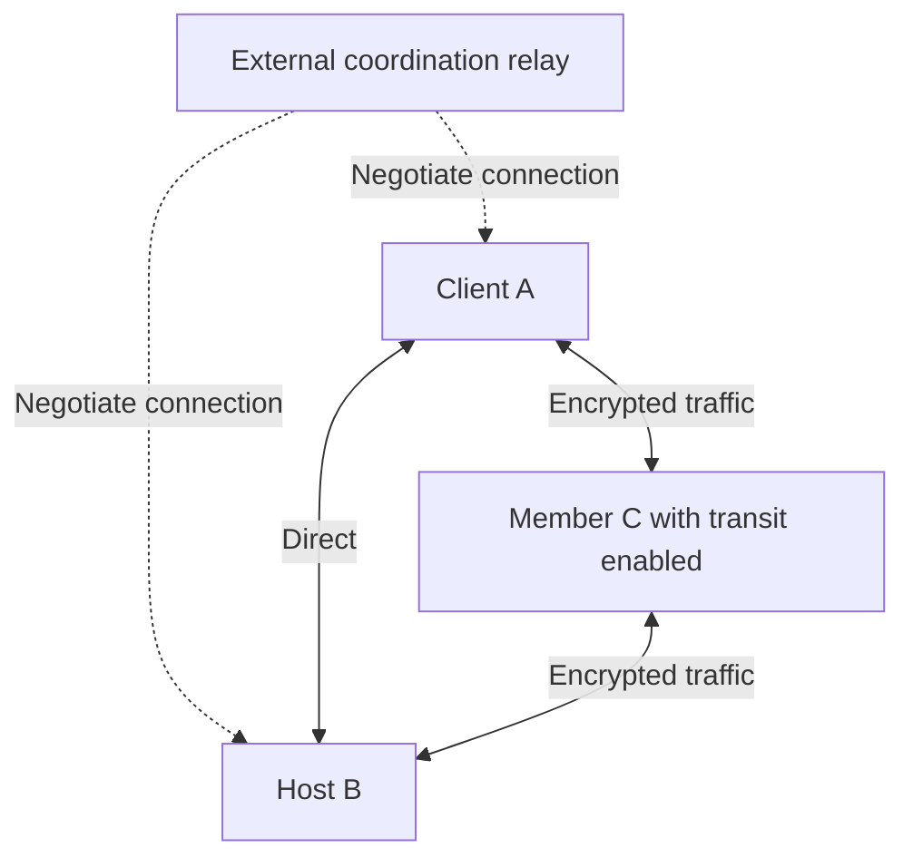
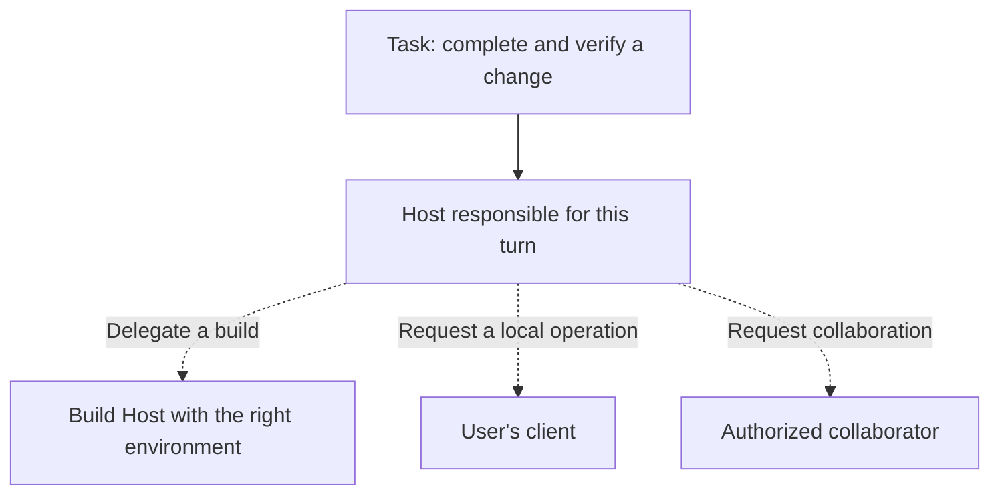

<!--
  Licensed to the Apache Software Foundation (ASF) under one
  or more contributor license agreements.  See the NOTICE file
  distributed with this work for additional information
  regarding copyright ownership.  The ASF licenses this file
  to you under the Apache License, Version 2.0 (the
  "License"); you may not use this file except in compliance
  with the License.  You may obtain a copy of the License at

      http://www.apache.org/licenses/LICENSE-2.0

  Unless required by applicable law or agreed to in writing,
  software distributed under the License is distributed on an
  "AS IS" BASIS, WITHOUT WARRANTIES OR CONDITIONS OF ANY
  KIND, either express or implied.  See the License for the
  specific language governing permissions and limitations
  under the License.
-->

[简体中文](./peer-mesh.zh-CN.md)

# Maka Peer Mesh: From Remote Access to Work Across Devices

An Agent task may not belong entirely on the computer in front of you. A laptop is convenient for interaction, a machine at home can stay running, and another workstation may have the environment a task needs. Teammates also have their own tools, data, and permissions.

[Runtime Host](./runtime-host.md) lets execution exist independently of the client. The next question is how these distributed endpoints find one another and keep cooperating as their networks change.

Maka's Peer Mesh provides an application-level networking foundation. It starts with identity, membership, connectivity, and recovery. On that foundation, Maka can explore workflows that combine execution capabilities across devices.

Private meshes, direct connections, and controlled transit are implemented today, though Peer Mesh remains experimental. This article explains those mechanisms before exploring the product directions they enable. Automatic capability discovery and cross-Host scheduling in the latter part are future possibilities.[^scope]

## Connecting Maka Endpoints

A Peer Mesh node is a Maka client or Runtime Host. A client and Host on the same computer can have different identities and lifetimes. One client can also use its peer endpoint to connect to multiple Hosts.

This network carries Maka protocol traffic. It does not assign virtual IP addresses to machines or expose arbitrary ports. Joining a Mesh does not give other members a path to databases, file shares, or unrelated local services.

That scope allows networking to fit directly into Maka's interaction model: invitations, joining, member management, and the choice to help relay traffic all belong to the application. SSH, TLS, and external network overlays remain available; Peer Mesh adds a native path for Maka.[^scope]

## Recognize the Peer Before Looking for Its Address

An IP address describes where to try connecting now. It is a poor answer to who is on the other end. A laptop changes address when it changes networks, and a restarted machine should not become a new member.

Maka identifies an endpoint with a key-based **PeerId**. Connections must authenticate the expected PeerId rather than accept whoever responds at an address. Addresses can change while the target identity remains stable.

Membership lives in a separate **Mesh roster**. The Mesh authority signs a versioned member list. Other nodes verify the signature and reject updates from the wrong authority or outdated versions. Joining requires an explicit invitation; removing a member or closing the Mesh also updates that record.

Data can therefore flow directly between members while membership changes retain an explicit signer. Changing the roster requires the authority's participation; ordinary communication does not route every message through it. The current implementation targets small private networks, with at most 64 members per Mesh.[^membership]

Several related questions have different answers:

| Question | Evidence |
|---|---|
| Who is this peer? | PeerId and connection authentication |
| Does it belong to this Mesh? | The authority-signed roster |
| Where can it be reached now? | The peer's signed reachability record |
| What may it do after connecting? | The target Host's credentials and resource grants |

Connectivity, recovery, and collaboration all depend on keeping these facts separate.

## Addresses Expire Without Ending Membership

Saving the address from one successful connection is not enough. A home network can reconnect with a new address, a laptop can sleep, and a relay reservation can expire. An address book that never changes soon stops being useful.

Maka lets each peer publish a signed **reachability lease**. It contains its PeerId, revision, expiry, and current direct and coordination-relay routes. A recipient checks identity, revision, and validity before accepting it as a new connection hint. Receiving the same record again does not extend its lifetime.

Members exchange new records through incremental point-to-point reconciliation: compare known revisions and fill in missing or newer information. Address changes and restored connections trigger synchronization, while periodic checks catch missed events. This keeps a small Mesh up to date without broadcasting every business message across the network.[^reachability]

Being temporarily unreachable is therefore different from no longer belonging to the Mesh. When old routes expire, Maka retains membership and looks for new hints through other members or previously successful relays. It remembers relay addresses; it does not assume yesterday's reservation is still valid.

Recovery has a physical limit. If both peers have changed addresses, no old route works, and nobody else knows their new locations, a PeerId alone cannot send the first packet. Maka enters `needs_repair`, allowing a fresh invitation or another bootstrap path to supply new hints while preserving the original identity and membership.

Guaranteeing that peers can always find each other after prolonged downtime would require choosing a stable rendezvous service and an operating model for it. Someone has to provide the availability of address discovery; cryptographic identity cannot supply it by itself.[^recovery]

## Members Can Help When Direct Connections Fail

Home and mobile networks commonly sit behind NAT. Being able to initiate an outbound connection does not mean an outside peer can connect back. The endpoints first need to exchange hints and try to establish a usable path.

Maka's native peer endpoint uses Rust/libp2p. It supports paths including QUIC and TCP, with DCUtR coordinating hole punching. WebRTC ICE offers another opportunity for a direct connection by trying different candidates in networks where the original path cannot connect. These paths share the business endpoint's PeerId and carry the same Runtime Host protocol once established.[^transport]

Two kinds of relay serve different purposes:

- **Coordination relays** help peers meet, exchange control information, and negotiate direct connections. External public relays have this role; they do not carry Runtime Host application traffic.
- **Member transit** is explicitly enabled by a node inside the Mesh. It can carry application traffic for permitted members when a direct path is unavailable.

The diagram shows alternative paths. Dotted lines carry coordination information; solid lines carry application traffic. An actual connection uses only an eligible path.

Member transit is off by default and enabled by the operator for a selected Mesh. It is currently limited to one hop, with limits on connection count, duration, and traffic. The client and target Host retain end-to-end authentication and encryption. The transit peer gains neither application plaintext nor permission to operate the target Host.[^transit]

Connection attempts can dial known addresses immediately while incorporating newly discovered candidates. Candidates share the target identity, deadline, and cancellation signal; late results are discarded after a winner is selected. The race is between ways to establish a connection, not between copies of the same business command sent down several paths.[^dialing]

If neither a direct path nor approved member transit works, the connection fails. Peer Mesh adds possible routes; it does not eliminate every network topology constraint.

## A Path Change Does Not Redefine a Task or Its Permissions

A brief path change need not restart the application session. Maka tracks sent and acknowledged byte positions in its peer stream and retains a bounded amount of unacknowledged data. After attaching a new path, it can retransmit those bytes and deduplicate them at the receiver, preserving the logical connection.

This transport recovery operates within the same process and has time and memory limits. A reattached stream must still match the original peer and authenticated identity. A Host restart requires fresh authentication and session subscriptions. Business operations with unknown outcomes cannot be replayed automatically by the network layer.[^continuity]

After connecting, the target Host still validates credentials, the expected State Root identity, and permission for each operation. A Mesh invitation grants network membership; sharing a Session uses that Session's own authorization flow.

Revoking Session access does not remove someone from the entire Mesh. Removing them from the Mesh does not automatically revoke Host credentials they might use through SSH or another path. Network membership and resource authorization can change independently, allowing the application to scope collaboration to a task.[^authorization]

## What This Foundation Opens Up for Maka

Today, Peer Mesh primarily provides recognizable identities, discoverable routes, connections, and recovery under defined conditions. Once nodes can communicate, the larger opportunity is this: **people can choose capabilities around the work, instead of always arranging work around one machine.**

Three directions are worth building on this foundation.

### From Separate Installations to a Personal Work Network

A person might interact on a laptop, leave a long task running on a Host at home, and return from another device to check progress or handle an approval. Remote Hosts, session protocols, and Peer Mesh already provide foundations for this workflow.

Future clients could become lighter entry points: discover the Hosts a user is authorized to access, remember where each task belongs, and use whichever connection path is currently available. Cross-device task discovery, identity continuity, and offline experience still need work. A cached row in a task list cannot establish that the task is still running.

### From Choosing a Machine to Combining Capabilities

One machine may be suited to builds, another may have local applications attached, and another may offer model inference. A future Maka could route requests to suitable nodes according to the capabilities a task needs.

Client Capability already lets a Host use tools offered by a client. The next opportunity is to extend explicitly authorized calls into a discoverable capability network. Today's Mesh advertisements describe identity, endpoint kind, and transit availability; they are not a tool or compute catalog. Capability discovery, versions, availability, quotas, and authorization need their own design.

The following diagram is a possible future workflow. Dotted lines represent cross-node orchestration that still needs to be developed:

A capability can be called remotely while its provider retains permission to decide what it will execute. The network delivers messages; the capability protocol defines the execution commitment.

### From Shared Sessions to Tasks Across Hosts

Session sharing currently lets another person participate in work on a particular Host. A further step would let several Hosts take responsibility for subtasks: one builds and tests, another validates a specific environment, and both return results to the Host responsible for the overall turn.

This has different failure modes from spawning several subagents within one Host. Nodes can go offline independently, results can arrive late, and a remote task can still be running after cancellation. Cross-Host collaboration needs durable delegation records, explicit executors, result provenance, and cancellation rules. Peer Mesh supplies connectivity; it does not create those scheduling semantics or replicate different Hosts' State Roots into one shared state.

The long-term value of Peer Mesh lies in these workflows. Devices retain their data and permissions while tasks use capabilities distributed across them. Maka's scope of collaboration can then grow from one client and one Host into a network of participants able to contribute to the work.

## Implementation References

Current mechanisms correspond to repository commit [`8d5c4612`](https://github.com/apache/maka/commit/8d5c4612c46b19270f00fe7aea33c39dff23dbe5). The future directions are design inferences from these mechanisms, not completed product features.

[^scope]: [Peer Mesh scope, milestones, and boundaries](https://github.com/apache/maka/issues/3842); [Mesh components for clients and Hosts](https://github.com/apache/maka/blob/8d5c4612c46b19270f00fe7aea33c39dff23dbe5/packages/runtime-host/src/peer-mesh/owner.ts).
[^membership]: [Signed rosters and member advertisements](https://github.com/apache/maka/blob/8d5c4612c46b19270f00fe7aea33c39dff23dbe5/packages/runtime-host/src/peer-mesh/model.ts), [invitations and membership management](https://github.com/apache/maka/blob/8d5c4612c46b19270f00fe7aea33c39dff23dbe5/packages/runtime-host/src/peer-mesh/node.ts), and [current scale limits](https://github.com/apache/maka/blob/8d5c4612c46b19270f00fe7aea33c39dff23dbe5/packages/runtime-host/src/peer-mesh/limits.ts).
[^reachability]: [Reachability leases and duplicate-record expiry](https://github.com/apache/maka/blob/8d5c4612c46b19270f00fe7aea33c39dff23dbe5/packages/runtime-host/src/peer-reachability/model.ts), [durable revision publishing](https://github.com/apache/maka/blob/8d5c4612c46b19270f00fe7aea33c39dff23dbe5/packages/runtime-host/src/peer-reachability/publisher.ts), and [incremental member reconciliation](https://github.com/apache/maka/blob/8d5c4612c46b19270f00fe7aea33c39dff23dbe5/packages/runtime-host/src/peer-mesh/node.ts).
[^recovery]: [Reachability recovery conditions and design](https://github.com/apache/maka/issues/4554), [rediscovering existing members](https://github.com/apache/maka/pull/4893), and [relay anchor storage](https://github.com/apache/maka/blob/8d5c4612c46b19270f00fe7aea33c39dff23dbe5/native/runtime-host-peer/src/engine/relay_anchor_store.rs).
[^transport]: [Native connection implementation](https://github.com/apache/maka/blob/8d5c4612c46b19270f00fe7aea33c39dff23dbe5/native/runtime-host-peer/src/engine.rs), [WebRTC upgrades and target identity validation](https://github.com/apache/maka/blob/8d5c4612c46b19270f00fe7aea33c39dff23dbe5/native/runtime-host-peer/src/webrtc_direct/upgrade.rs); [WebRTC evidence and coverage boundaries](https://github.com/apache/maka/issues/4382).
[^transit]: [Bounded one-hop transit](https://github.com/apache/maka/pull/4142), [transit policy reconciliation](https://github.com/apache/maka/pull/4144), and [controls and diagnostics](https://github.com/apache/maka/pull/4147).
[^dialing]: [Recovering live routes within one connection attempt](https://github.com/apache/maka/pull/4580), [peer client](https://github.com/apache/maka/blob/8d5c4612c46b19270f00fe7aea33c39dff23dbe5/packages/runtime-host/src/client/peer-client.ts).
[^continuity]: [Resumable byte stream](https://github.com/apache/maka/blob/8d5c4612c46b19270f00fe7aea33c39dff23dbe5/packages/runtime-host/src/transport/resumable-peer-stream.ts), [credential and identity checks on recovery](https://github.com/apache/maka/blob/8d5c4612c46b19270f00fe7aea33c39dff23dbe5/packages/runtime-host/src/server/peer-listener.ts); [path changes and logical connections](https://github.com/apache/maka/pull/4830).
[^authorization]: [Separate Mesh and resource-sharing scopes](https://github.com/apache/maka/issues/3842), [shared-session access lifecycle](https://github.com/apache/maka/pull/4907), and [client capability invocation](https://github.com/apache/maka/blob/8d5c4612c46b19270f00fe7aea33c39dff23dbe5/packages/runtime-host/src/server/client-capability-invocation-broker.ts).
