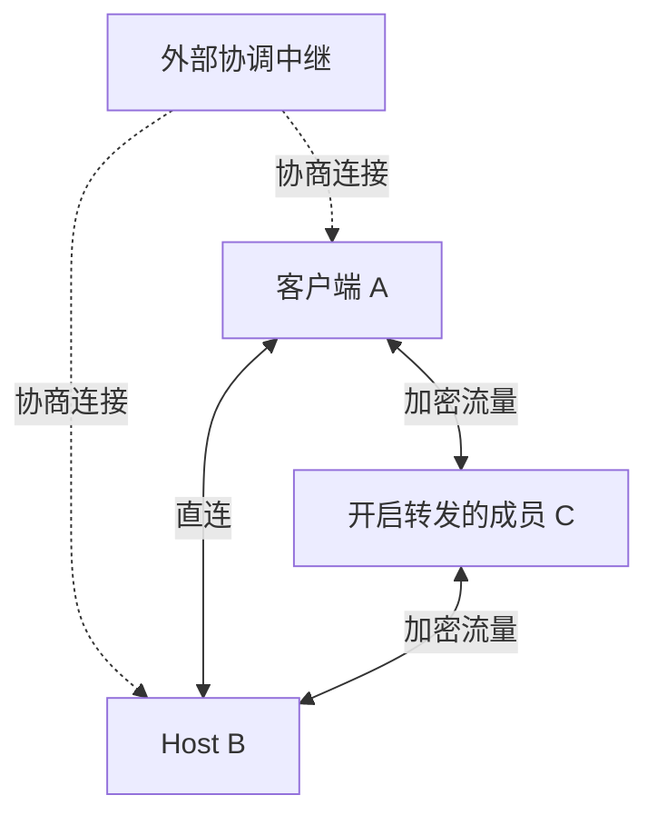
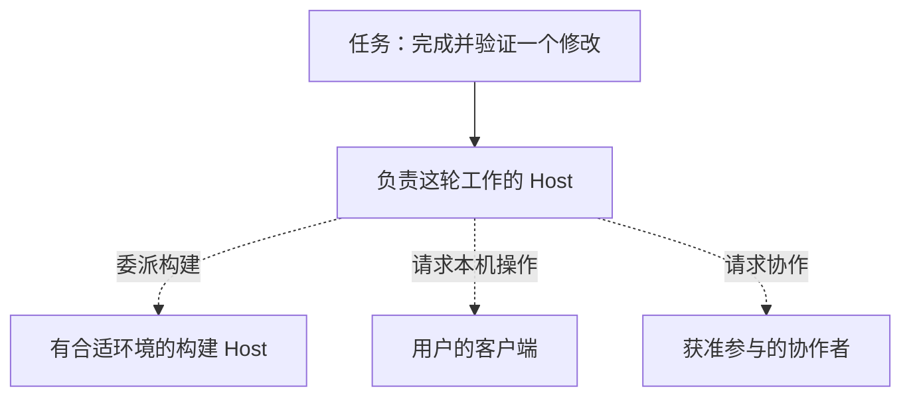

<!--
  Licensed to the Apache Software Foundation (ASF) under one
  or more contributor license agreements.  See the NOTICE file
  distributed with this work for additional information
  regarding copyright ownership.  The ASF licenses this file
  to you under the Apache License, Version 2.0 (the
  "License"); you may not use this file except in compliance
  with the License.  You may obtain a copy of the License at

      http://www.apache.org/licenses/LICENSE-2.0

  Unless required by applicable law or agreed to in writing,
  software distributed under the License is distributed on an
  "AS IS" BASIS, WITHOUT WARRANTIES OR CONDITIONS OF ANY
  KIND, either express or implied.  See the License for the
  specific language governing permissions and limitations
  under the License.
-->

[ENGLISH](./peer-mesh.md)

# Maka Peer Mesh：从远程访问，到跨设备协作

一项 Agent 任务，未必适合全部放在眼前这台电脑上。笔记本方便交互，家里的机器可以长期运行，另一台工作站可能有任务需要的环境。团队成员也各自拥有工具、数据和权限。

[Runtime Host](./runtime-host.zh-CN.md) 让执行可以独立于客户端存在。接下来的问题是：这些分散的节点，怎样找到彼此，并在网络变化后继续合作？

Maka 的 Peer Mesh 为此提供一层应用内的网络基础。它先解决身份、成员关系、连接和恢复；在这之上，Maka 才有机会把不同设备上的执行能力组织成更完整的工作流。

目前 Peer Mesh 已实现私有 Mesh、直连和受控转发，仍处于实验阶段。本文先解释这些机制，再讨论它们打开的产品方向。后半部分的自动发现能力和跨 Host 调度属于未来设想。[^scope]

## 连接的是 Maka 端点

Peer Mesh 的节点是一个 Maka 客户端或 Runtime Host。同一台电脑上的客户端与 Host 可以有不同的身份和生命周期；一个客户端也可以通过自己的 peer 端点连接多个 Host。

这层网络承载 Maka 的协议流量，不为整台机器分配虚拟 IP，也不开放任意端口。加入 Mesh 之后，其他成员不会因此获得访问数据库、文件共享或本机服务的通道。

这个范围让连接可以直接进入 Maka 的交互流程：邀请、加入、查看成员、选择是否帮助转发，都由应用管理。已有的 SSH、TLS 或外部组网方式仍然可用，Peer Mesh 为 Maka 增加了一条原生路径。[^scope]

## 先认出节点，再寻找地址

IP 地址适合描述“目前到哪里连接”，却不适合回答“对方是谁”。笔记本换了网络，地址会变；机器重启后，也不应该被当作新成员。

Maka 使用基于密钥的 **PeerId** 识别端点。建立连接时要验证预期的 PeerId，而不是只要某个地址响应就接受它。地址可以更新，目标身份保持不变。

成员关系则由另一份记录管理：**Mesh roster（成员名册）**。Mesh 的管理端签署名册，记录成员和版本；其他节点可以验证签名，并拒绝错误来源或过时的更新。加入通过显式邀请完成，移除成员或关闭 Mesh 也需要更新这份记录。

这意味着数据可以在成员之间直接流动，成员管理仍有明确的签署者。修改名册需要管理端参与，普通通信不要求每条消息都经过它。当前实现面向小规模私有网络，每个 Mesh 最多 64 个成员。[^membership]

几个看似相近的问题，由不同事实回答：

| 问题 | 依据 |
|---|---|
| 对方是谁？ | PeerId 与连接认证 |
| 对方是否属于这个 Mesh？ | 管理端签名的成员名册 |
| 现在从哪里能找到它？ | 节点签名的可达性记录 |
| 连上之后能做什么？ | 目标 Host 的凭据和资源授权 |

后面的连接、恢复和协作，都建立在这四件事分开管理的基础上。

## 地址会过期，成员关系不会因此消失

保存一次连接成功时的地址还不够。家中网络可能重新拨号，笔记本可能休眠，中继上的预约也会到期。一张永不更新的地址簿，很快就会失效。

Maka 让节点发布带签名的 **reachability lease（可达性租约）**：它包含 PeerId、版本、有效期，以及当前可尝试的直连地址和协调中继地址。接收方验证身份、版本和期限后，才把它当作新的连接线索。重复收到同一份记录，不会重新延长它的有效期。

成员会相互交换新记录。实现采用点对点的增量核对：比较已知版本，补齐缺失或更新的信息；地址变化、连接恢复等事件会唤醒同步，周期性检查负责补漏。它服务于小规模 Mesh 的状态收敛，无需让每条业务消息都参与全网广播。[^reachability]

因此，“暂时找不到这个节点”和“它已经不属于 Mesh”是两种状态。旧地址失效后，Maka 仍保留成员关系，并尝试从其他成员或曾经成功使用的中继取得新线索。记住的是中继地址，不是把上次的预约当作仍然有效。

恢复也有物理边界：如果两端的地址都变了，没有任何旧路径可用，也没有第三方知道新位置，仅凭 PeerId 无法发出第一包数据。此时会进入 `needs_repair`，通过新邀请等方式补充连接线索，保留原来的身份和成员关系。

若未来要保证长时间离线后仍能随时找回彼此，就需要选择稳定的会合服务及其运维方式。地址发现的可用性，需要有人提供；密码学身份本身不能代替它。[^recovery]

## 直连之外，成员可以帮彼此接通

普通家庭和移动网络通常隔着 NAT。设备能主动访问外部，不代表外部可以直接连进来。两端需要先交换连接线索，再尝试建立可用路径。

Maka 的原生 peer 端点基于 Rust/libp2p，支持 QUIC、TCP 等连接路径，并使用 DCUtR 协调打洞。WebRTC ICE 提供另一种直连机会：在一些原路径无法打通的网络中尝试不同的候选地址。它们共用业务端点的 PeerId，建立路径后仍承载同一套 Runtime Host 协议。[^transport]

这里有两种用途不同的中继：

- **协调中继**帮助节点相遇、交换控制信息和协商直连。外部公共中继属于这一类，不承载 Runtime Host 的应用流量。
- **成员转发**由 Mesh 内的节点明确开启。在直连不可用时，它可以为获准成员承载应用流量。

下面展示的是可选路径。虚线表示协调信息，实线表示应用流量；实际连接只使用符合条件的路径。

成员转发默认关闭，由操作者为选定的 Mesh 开启。当前限制为一跳，并约束连接数量、持续时间和流量。客户端与目标 Host 之间保持端到端认证和加密，转发方不取得应用明文或操作目标 Host 的权限。[^transit]

建立连接时，已有地址可以立即尝试，新发现的地址继续加入同一次连接尝试。候选路径共用目标身份、截止时间和取消信号，胜出后丢弃迟到结果。竞争的是建立连接的方式，不会把同一条业务命令分别发到多条路径上执行。[^dialing]

直连与成员转发都不可用时，连接会失败。Peer Mesh 增加可用的路径，并没有消除所有网络拓扑的限制。

## 换了路径，任务和权限仍有自己的边界

一次短暂换路不一定要让上层会话重新开始。Maka 在 peer 字节流上记录发送位置和确认位置，保留有界的待确认数据。接上新路径后，可以补发尚未确认的字节，并在接收端去重，让原来的逻辑连接继续工作。

这是同一进程内、有时间和内存边界的传输恢复。接回来的流还必须匹配原来的 peer 与认证身份。Host 重启后，需要重新认证和建立会话订阅；结果未知的业务操作不能靠网络层自动重放。[^continuity]

网络接通后，目标 Host 仍要验证凭据、目标数据根身份，并检查每项操作的权限。Mesh 邀请授予的是网络成员资格；共享某个 Session，要走该 Session 自己的授权流程。

撤销 Session 共享，不会把对方逐出整个 Mesh。移出 Mesh，也不会自动撤销对方可能通过 SSH 等其他路径使用的 Host 凭据。网络成员管理和资源授权可以各自变化，应用才能把协作范围精确到一项任务。[^authorization]

## 这层基础，能让 Maka 走向哪里

Peer Mesh 当前提供的主要是“认得出、找得到、连得上，并能在一定条件下恢复”。节点之间能够通信之后，更大的设计空间在于：**用户可以围绕工作选择能力，而不必始终围绕一台机器安排工作。**

以下是这层基础值得继续支撑的三个方向。

### 从多个安装实例，到个人工作网络

一个人可能在笔记本上交互，让家中的 Host 执行长任务，再从另一台设备回来查看和处理审批。已有的远程 Host、会话协议和 Peer Mesh，已经为这种使用方式提供了基础。

未来的客户端可以进一步成为轻入口：知道用户有哪些获准访问的 Host，记住任务归属，自动使用当前可用的连接路径。需要改进的是跨设备的任务发现、身份衔接和离线体验；不能把任务列表里的一行缓存，当作任务仍在运行的证明。

### 从选择机器，到组合不同节点的能力

有的机器适合构建，有的接着本机应用，有的可以提供模型推理服务。一项工作需要这些能力时，未来的 Maka 可以根据能力把请求送到合适的节点。

Client Capability 已经允许 Host 使用客户端提供的工具。下一步的空间，是把这种明确授权的调用扩展成可发现、可选择的能力网络。当前 Mesh 的成员信息描述身份、端点类型和是否提供转发，还不是工具或算力目录；能力发现、版本、可用性、配额和授权需要另外设计。

下面描绘的是未来可能的工作流，虚线表示尚需完善的跨节点编排：

关键是，能力可以被远程调用，权限仍由提供方决定。网络负责送达，能力协议负责定义执行承诺。

### 从共享会话，到跨 Host 的任务协作

目前的 Session 共享让别人参与某个 Host 上的任务。更进一步，团队中的多个 Host 可以各自承担子任务：一个构建和测试，一个处理特定环境中的验证，再把结果交回负责整轮工作的 Host。

这与在一台 Host 内启动多个子 Agent 有不同的难点。节点可能独立离线，结果可能延迟到达，任务可能已经取消而远端还在执行。跨 Host 协作需要持久的委派记录、明确的执行者、结果来源和取消规则。Peer Mesh 提供连接，但不会自动生成这套调度语义，也不会把不同 Host 的 State Root 复制成同一份状态。

Peer Mesh 的长期价值，会体现在这些工作流里：设备保留自己的数据与权限，任务却可以使用分散在不同节点上的能力。Maka 的协作边界，也就有机会从一个客户端、一台 Host，扩展到一张可参与工作的网络。

## 实现参考

当前机制对应仓库提交 [`8d5c4612`](https://github.com/apache/maka/commit/8d5c4612c46b19270f00fe7aea33c39dff23dbe5)。未来方向是基于这些机制的设计推演，不代表已完成的产品功能。

[^scope]: [Peer Mesh 的范围、阶段与边界](https://github.com/apache/maka/issues/3842)；[客户端与 Host 的 Mesh 组件](https://github.com/apache/maka/blob/8d5c4612c46b19270f00fe7aea33c39dff23dbe5/packages/runtime-host/src/peer-mesh/owner.ts)。
[^membership]: [签名成员名册与成员声明](https://github.com/apache/maka/blob/8d5c4612c46b19270f00fe7aea33c39dff23dbe5/packages/runtime-host/src/peer-mesh/model.ts)、[邀请、加入和成员管理](https://github.com/apache/maka/blob/8d5c4612c46b19270f00fe7aea33c39dff23dbe5/packages/runtime-host/src/peer-mesh/node.ts)、[当前规模限制](https://github.com/apache/maka/blob/8d5c4612c46b19270f00fe7aea33c39dff23dbe5/packages/runtime-host/src/peer-mesh/limits.ts)。
[^reachability]: [可达性租约及重复记录的时效处理](https://github.com/apache/maka/blob/8d5c4612c46b19270f00fe7aea33c39dff23dbe5/packages/runtime-host/src/peer-reachability/model.ts)、[持久发布版本](https://github.com/apache/maka/blob/8d5c4612c46b19270f00fe7aea33c39dff23dbe5/packages/runtime-host/src/peer-reachability/publisher.ts)、[成员间的增量同步](https://github.com/apache/maka/blob/8d5c4612c46b19270f00fe7aea33c39dff23dbe5/packages/runtime-host/src/peer-mesh/node.ts)。
[^recovery]: [可达性恢复的条件与设计](https://github.com/apache/maka/issues/4554)、[恢复已有成员的连接](https://github.com/apache/maka/pull/4893)、[中继锚点存储](https://github.com/apache/maka/blob/8d5c4612c46b19270f00fe7aea33c39dff23dbe5/native/runtime-host-peer/src/engine/relay_anchor_store.rs)。
[^transport]: [原生连接实现](https://github.com/apache/maka/blob/8d5c4612c46b19270f00fe7aea33c39dff23dbe5/native/runtime-host-peer/src/engine.rs)、[WebRTC 接入与目标身份校验](https://github.com/apache/maka/blob/8d5c4612c46b19270f00fe7aea33c39dff23dbe5/native/runtime-host-peer/src/webrtc_direct/upgrade.rs)；[WebRTC 的实验依据与覆盖边界](https://github.com/apache/maka/issues/4382)。
[^transit]: [受控单跳转发](https://github.com/apache/maka/pull/4142)、[转发策略收敛](https://github.com/apache/maka/pull/4144)、[操作与诊断](https://github.com/apache/maka/pull/4147)。
[^dialing]: [在同一次连接尝试中恢复可用路由](https://github.com/apache/maka/pull/4580)、[peer 客户端](https://github.com/apache/maka/blob/8d5c4612c46b19270f00fe7aea33c39dff23dbe5/packages/runtime-host/src/client/peer-client.ts)。
[^continuity]: [可恢复字节流](https://github.com/apache/maka/blob/8d5c4612c46b19270f00fe7aea33c39dff23dbe5/packages/runtime-host/src/transport/resumable-peer-stream.ts)、[恢复时的凭据与身份校验](https://github.com/apache/maka/blob/8d5c4612c46b19270f00fe7aea33c39dff23dbe5/packages/runtime-host/src/server/peer-listener.ts)；[路径切换与逻辑连接](https://github.com/apache/maka/pull/4830)。
[^authorization]: [Mesh 与资源共享的独立范围](https://github.com/apache/maka/issues/3842)、[共享会话访问的生命周期](https://github.com/apache/maka/pull/4907)、[客户端能力调用](https://github.com/apache/maka/blob/8d5c4612c46b19270f00fe7aea33c39dff23dbe5/packages/runtime-host/src/server/client-capability-invocation-broker.ts)。
