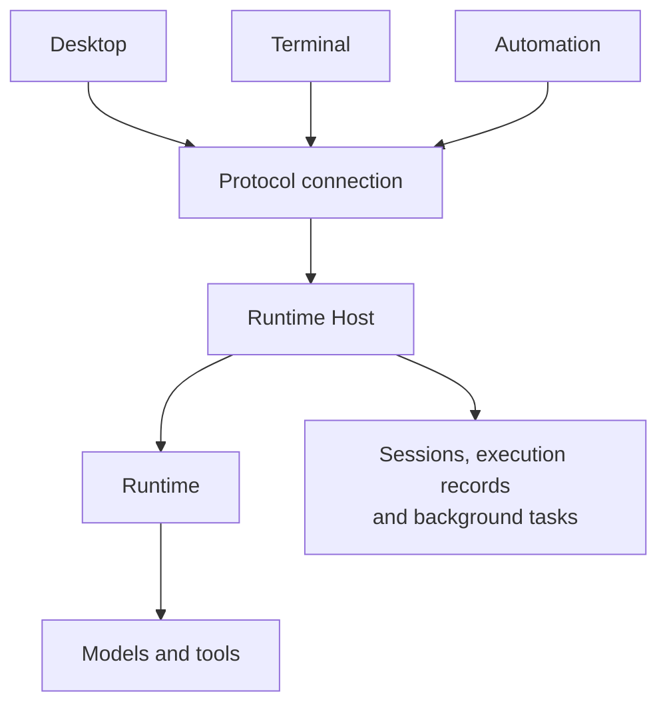
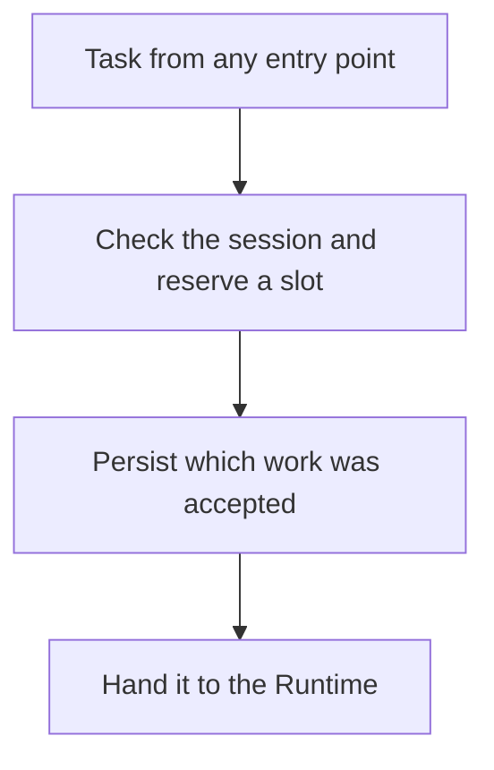
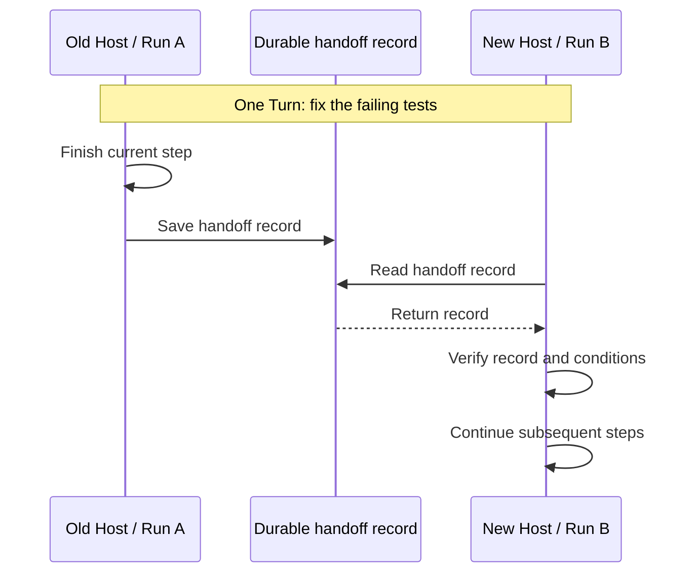

<!--
  Licensed to the Apache Software Foundation (ASF) under one
  or more contributor license agreements.  See the NOTICE file
  distributed with this work for additional information
  regarding copyright ownership.  The ASF licenses this file
  to you under the Apache License, Version 2.0 (the
  "License"); you may not use this file except in compliance
  with the License.  You may obtain a copy of the License at

      http://www.apache.org/licenses/LICENSE-2.0

  Unless required by applicable law or agreed to in writing,
  software distributed under the License is distributed on an
  "AS IS" BASIS, WITHOUT WARRANTIES OR CONDITIONS OF ANY
  KIND, either express or implied.  See the License for the
  specific language governing permissions and limitations
  under the License.
-->

[简体中文](./runtime-host.zh-CN.md)

# Maka Runtime Host: How Multiple Clients Share the Same Work

You ask Maka's desktop app to fix the failing tests in a project. The Agent starts reading code, editing files, and running tests. A little later, you open a terminal to check its progress.

If each client runs its own Agent, sharing the conversation history won't solve the problem. The desktop app may know that tests are still running while the terminal thinks the previous turn has finished. Resending a message could start another task.

Both clients need a common place responsible for execution. Maka calls it the **Runtime Host**. It manages when work starts and ends, saves execution facts, and lets clients participate through a protocol.

## From an Execution Loop to Its Host

The Runtime runs the Agent loop: assemble context, call a model, run tools, and feed the results back to the model. The Host handles the surrounding responsibilities: who may start work, who may write the data, what happens when a client disconnects, and how to recover and clean up when the process starts or stops.

Desktop, terminal, and automation clients consequently share the same way in:

A Host can run locally or on a remote machine. Clients submit requests and read progress; the machine running the work resolves the working directory, accesses files, and runs commands. Opening a remote session in a terminal does not reinterpret the remote project path as a local path.

There is a division of responsibilities inside the Host, too. The Kernel manages startup, connections, and shutdown. Domains such as sessions, Goals, and scheduled tasks are assembled through a **composition**. Each module declares its operations, recovery behavior, and cleanup. Two modules cannot claim the same protocol operation.

This determines the recovery order: persistent state first, then resources and executions, followed by domain state and schedulers. Otherwise, a scheduled task could start new work before the previous execution has been reconciled. The Host enters Ready only after recovery finishes. Being able to connect before then does not mean business operations can already execute.[^composition]

## Establish a Single Writer First

The desktop and terminal clients may start at the same time. Both check for a Host, find none, and launch a process. This race sits between checking and starting; a PID file or the existence of a socket cannot settle it.

Maka calls the directory holding its persistent state a **State Root**. Only one Host may write to a State Root at a time. A process must acquire an operating system lock before it can open storage, run migrations, and admit work as that Root's Host. Registration files and socket addresses help clients discover the Host. The lock determines who may write.

Two identities matter here. A `rootId` identifies the persistent data; a `HostEpoch` identifies the current Host process instance. After a restart, the data is still the same, but the process identity has changed. Clients can therefore recognize old connections, observations, and upgrade requests instead of applying them to the new process.

Graceful shutdown respects the same boundary: stop admitting work, wait for existing work to finish or hand over safely, close storage, and finally release write ownership. A successor must acquire ownership that the previous process has actually relinquished.[^ownership]

## Give Every Task the Same Entry Point

Having one Host is only the first step. Its internal entry points must also agree about execution. User messages, the next step of a Goal, scheduled tasks, and automation calls can all ask to start work.

Maka centralizes root execution in `RootTurnCoordinator`. A root execution begins a turn of work. It can spawn subagents, but a session can have only one root execution active at a time. Different sessions can still run in parallel.

New work first passes through **admission**. This stage serializes checks within a session, reserves an execution slot, and persists the request identity, message content, and associated execution record before handing work to the Runtime. The critical section protects admission; it is not held for the duration of the execution.

Saving admission first has a practical use. A client that sent a request but received no reply can return with the original identity to check. The Host compares identity and content to determine whether it already accepted that work. Reusing an identity with different content is rejected; retrying an accepted request cannot turn it into a new task.

The record also gives recovery a starting point. The Host can distinguish work accepted but not yet started from work started but not finished. If admission itself is uncertain, it stops further execution rather than risking repeated side effects on an unverified basis.[^admission]

## Let Clients Catch Up Without Owning Progress

Once work belongs to the Host, clients see a view of its execution state. [Log Is the Runtime](./log-is-the-runtime.md) explains the underlying record: model and tool execution events are saved in `RuntimeEvents`. For regular runtime sessions, conversation history is derived from those events. A reopened interface can rebuild its view from persisted facts.

Live updates introduce an easy-to-miss gap. If a client first queries a snapshot and then subscribes to events, a task could finish between those two steps, leaving the client without its completion notification.

Maka establishes the snapshot and the starting sequence for subsequent events together when opening a subscription. The Host sends the subscription-open response before sending later events, so the client knows where to begin. If event sequences have a gap, or `HostEpoch` changes, the client opens a new subscription and reads the current state.

Long histories load in pages, and live subscriptions have bounded buffers. Terminal output uses a separate subscription so a burst of logs cannot overwhelm conversation updates. Neither a slow history reader nor a fast tool producer becomes a reason to accumulate unlimited memory.[^observation]

Reconnection must also distinguish reading from execution. Queries can be retried under the protocol's rules. A mutation that was sent but has no result may already have happened, with only its response lost. The general connection layer cannot simply resend it. Maka preserves the unknown outcome and lets the specific operation reconcile it against durable records. The desktop's outgoing queue likewise saves text and attachments before clearing the composer, so unconfirmed delivery is not mistaken for a message that was never sent.[^delivery]

## One Connection Can Work in Both Directions

Local connections use Unix sockets or Windows named pipes. Remote access can use WebSocket, SSH, or the peer network. Once inside the Host, these transports use the same operation protocol and permission checks. Domain modules do not need separate local and remote implementations.

The protocol works in both directions. A task on a remote Host may need a native operation supplied by the desktop client or an MCP tool connected to the local computer. A client can offer a **Client Capability**: the Host calls it, and the client executes it and returns the result.

This means the connection cannot finish handling one request before reading the next message. If the Host were waiting for a client tool result while its read loop remained blocked on the current request, both sides would wait for each other. Message reading and request execution therefore advance separately. Request concurrency is bounded, and health checks have reserved capacity so a busy connection can still establish whether its peer is alive.[^protocol]

Reverse calls also have an explicit execution boundary. The client first confirms that it can accept the call. The Host checks permissions and sends `admitted`; only then may the client execute. A disconnect before that boundary means the call was not authorized to proceed. After it, the operation may already have happened, so a missing result must be treated as unknown rather than repeated automatically.

Capabilities are bound to the appropriate client. For a session-bound tool, losing the original computer must not silently substitute another one: the tool name would stay the same while its execution environment changed. Session sharing follows the same attention to scope. Permission to view a session or submit requests for approval does not automatically grant access to the Host's files, settings, or tools.[^capabilities]

Peer connections also handle network path changes. Within the same Host process, byte offsets, acknowledgments, and deduplication can preserve the logical connection across a brief path change. A Host restart still requires a new connection and session subscription. These recovery mechanisms address transport continuity and business state separately; neither requires executing a business command twice.[^peer]

## A Host's Lifetime Is More Than a Window Count

Closing an interface, losing a connection, finishing a task, and stopping the Host are different events. An independently deployed Host may be running a Goal or waiting for a scheduled task even when no client is connected.

The Host therefore records reasons to stay alive as **residencies**, with two kinds:

| Kind | Example | Effect on shutdown |
|---|---|---|
| `idle`: retain the process | A future scheduled task or a paused Goal | Prevents natural idle exit, but does not block graceful shutdown |
| `drain`: work in progress | Executing a task, saving results, or admitting a request | Must finish or be handed over safely before graceful shutdown |

Conflating the two could make today's upgrade wait for a task scheduled for tomorrow. Counting only active model calls, on the other hand, could let the Host exit while saving results.

An admission request must register as active work before its first asynchronous wait. Otherwise, a request could already be waiting for session admission while remaining invisible to shutdown. Natural idle detection must also count connections still handshaking, not just clients that have finished connecting.[^residency]

Who decides to stop the process depends on deployment. An independent service belongs to its service manager. A Host launched and managed by the desktop app is closed by its launch-owner guard when the app exits. A connection can leave independently; whether the process continues has an explicit owner.

Write ownership and installation ownership are also managed separately. The operating system lock answers which process may write the data. The deployment ownership record answers which of Desktop, CLI, or a service manager may take over or replace the Host, preventing independent entry points from competing to update the same installation.[^deployment]

## Hand Over a Turn During an Upgrade

Long tasks may make it impractical to wait for an idle moment to upgrade. For runs that support continuation, Maka provides a safe handoff. The old Host pauses new work, lets the run stop at a durable model or tool step boundary, and saves continuation information for the new Host to verify and take over.

This requires a distinction between a **Turn** and a **Run**. A Turn is the logical round of work the user started; a Run is one physical execution carrying it out. An upgrade can end the old Run and create a new one while remaining within the same Turn.

The handoff record names the successor Run and includes information to verify the completed history. The new Host must validate that history and continuation relationship. Seeing unfinished work in a session is not enough to start executing it.

The execution configuration must also be recorded. Maka uses `RunComposition` to capture versions and digests of the execution's ingredients, including prompts, tools, and model-call options. Handoff additionally compares the actual execution conditions. Missing tools, a changed context window, or mismatched configuration can make continuation unsafe. Permitted dynamic tool changes receive their own versions rather than silently rewriting the initial record.

Finally, the Host must account for each piece of active work: it has either completed or been included in the handoff. There can be no asynchronous gap between the final check and the handoff commit, or unaccounted work could appear just after the Host decided it was safe to exit.

This mechanism does not migrate arbitrary process memory, PTYs, or external requests in flight. A sudden crash also lacks a prepared handoff. Whether execution can continue depends on the evidence available in durable records; runs that cannot resume safely receive an explicit interrupted state.[^handoff]

For the user, switching clients still means working on the original task. The Host makes that possible by connecting admission, durable records, observation, and lifecycle management. Each client can open and close independently, while every turn retains an identifiable executor and progress that can be checked.

## Implementation References

This article describes repository commit [`8d5c4612`](https://github.com/apache/maka/commit/8d5c4612c46b19270f00fe7aea33c39dff23dbe5).

[^composition]: [Host Kernel](https://github.com/apache/maka/blob/8d5c4612c46b19270f00fe7aea33c39dff23dbe5/packages/runtime-host/src/server/host-kernel.ts), [module composition and phased recovery](https://github.com/apache/maka/blob/8d5c4612c46b19270f00fe7aea33c39dff23dbe5/packages/runtime-host/src/server/host-composition.ts), and [Host workspace resolution](https://github.com/apache/maka/blob/8d5c4612c46b19270f00fe7aea33c39dff23dbe5/packages/runtime-host/src/server/workspace-resolver.ts).
[^ownership]: [State Root ownership](https://github.com/apache/maka/blob/8d5c4612c46b19270f00fe7aea33c39dff23dbe5/packages/storage/src/root-authority.ts); [Host-owned storage migrations](https://github.com/apache/maka/pull/4770).
[^admission]: [Shared root execution entry point](https://github.com/apache/maka/blob/8d5c4612c46b19270f00fe7aea33c39dff23dbe5/packages/runtime-host/src/server/root-turn-coordinator.ts), [session admission gate](https://github.com/apache/maka/blob/8d5c4612c46b19270f00fe7aea33c39dff23dbe5/packages/runtime-host/src/server/session-admission-gate.ts), and [durable admission records](https://github.com/apache/maka/blob/8d5c4612c46b19270f00fe7aea33c39dff23dbe5/packages/runtime-host/src/server/root-admission-owner.ts).
[^observation]: [Subscriptions and state continuity](https://github.com/apache/maka/blob/8d5c4612c46b19270f00fe7aea33c39dff23dbe5/packages/runtime-host/src/server/session-continuity-coordinator.ts); [session transcripts from execution events](https://github.com/apache/maka/pull/4879).
[^delivery]: [Client connections and requests](https://github.com/apache/maka/blob/8d5c4612c46b19270f00fe7aea33c39dff23dbe5/packages/runtime-host/src/client/connection.ts); [local message persistence and isolated terminal streams](https://github.com/apache/maka/pull/4956).
[^protocol]: [Connection read loop and request dispatch](https://github.com/apache/maka/blob/8d5c4612c46b19270f00fe7aea33c39dff23dbe5/packages/runtime-host/src/server/connection-session.ts), [protocol operations](https://github.com/apache/maka/blob/8d5c4612c46b19270f00fe7aea33c39dff23dbe5/packages/runtime-host/src/protocol/operations.ts).
[^capabilities]: [Client capability invocation](https://github.com/apache/maka/blob/8d5c4612c46b19270f00fe7aea33c39dff23dbe5/packages/runtime-host/src/server/client-capability-invocation-broker.ts), [capability provider binding](https://github.com/apache/maka/blob/8d5c4612c46b19270f00fe7aea33c39dff23dbe5/packages/runtime-host/src/server/client-capability-coordinator.ts); [session sharing and access lifecycle](https://github.com/apache/maka/pull/4907).
[^peer]: [Resumable peer byte streams](https://github.com/apache/maka/blob/8d5c4612c46b19270f00fe7aea33c39dff23dbe5/packages/runtime-host/src/transport/resumable-peer-stream.ts); [connection recovery across path changes](https://github.com/apache/maka/pull/4830).
[^residency]: [Host residency](https://github.com/apache/maka/blob/8d5c4612c46b19270f00fe7aea33c39dff23dbe5/packages/runtime-host/src/server/host-residency-registry.ts); [process retention versus active work](https://github.com/apache/maka/pull/5060).
[^deployment]: [Deployment ownership](https://github.com/apache/maka/blob/8d5c4612c46b19270f00fe7aea33c39dff23dbe5/packages/runtime-host/src/operator/local-deployment-owner.ts), [managed deployments](https://github.com/apache/maka/blob/8d5c4612c46b19270f00fe7aea33c39dff23dbe5/packages/runtime-host/src/operator/managed-deployment.ts); [Host lifetime when the desktop app quits](https://github.com/apache/maka/pull/4756).
[^handoff]: [Automatic Host handoff at safe boundaries](https://github.com/apache/maka/pull/4958); [execution composition records](https://github.com/apache/maka/blob/8d5c4612c46b19270f00fe7aea33c39dff23dbe5/packages/core/src/run-composition.ts), [logical execution and continuation validation](https://github.com/apache/maka/blob/8d5c4612c46b19270f00fe7aea33c39dff23dbe5/packages/core/src/runtime-logical-execution.ts).
