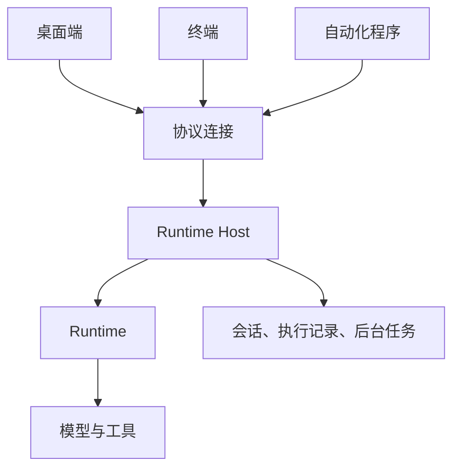
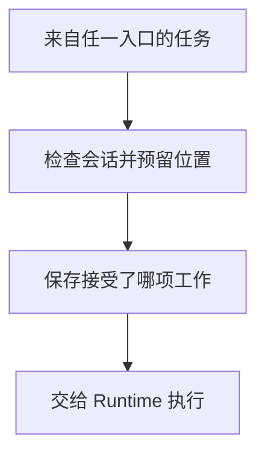
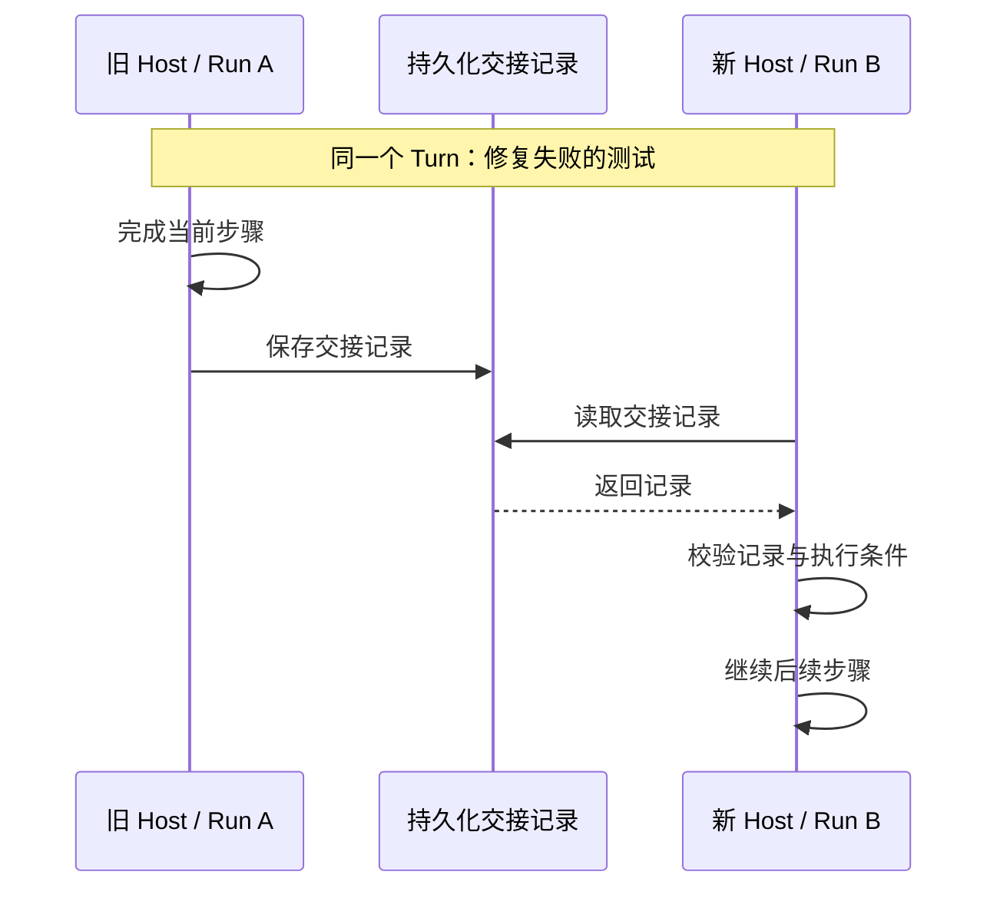

<!--
  Licensed to the Apache Software Foundation (ASF) under one
  or more contributor license agreements.  See the NOTICE file
  distributed with this work for additional information
  regarding copyright ownership.  The ASF licenses this file
  to you under the Apache License, Version 2.0 (the
  "License"); you may not use this file except in compliance
  with the License.  You may obtain a copy of the License at

      http://www.apache.org/licenses/LICENSE-2.0

  Unless required by applicable law or agreed to in writing,
  software distributed under the License is distributed on an
  "AS IS" BASIS, WITHOUT WARRANTIES OR CONDITIONS OF ANY
  KIND, either express or implied.  See the License for the
  specific language governing permissions and limitations
  under the License.
-->

[ENGLISH](./runtime-host.md)

# Maka Runtime Host：多个客户端，如何共享同一份工作

你在 Maka 桌面端发起了一项任务：“修复这个项目里失败的测试。”Agent 开始读代码、修改文件、运行测试。过了一会儿，你打开终端，想接着查看进度。

如果两个入口各自运行一份 Agent，共享聊天记录并不能解决问题。桌面端知道测试还在跑，终端却可能认为上一轮已经结束；同一条消息重发一次，也可能又启动一份任务。

要让它们接上同一份工作，需要有一个共同负责执行的地方。Maka 把它叫作 **Runtime Host**。它管理任务的开始与结束，保存执行事实，并让不同客户端通过协议参与其中。

## 从执行循环，到执行的宿主

Runtime 负责 Agent 的执行循环：组装上下文、调用模型、运行工具，再把结果交回模型。Host 则负责这个循环之外的事情：谁能发起任务、数据由谁写入、客户端断线后怎么办，以及进程启动和退出时如何收拾现场。

这让桌面端、终端和自动化程序有了相同的接入方式：

Host 可以在本机运行，也可以部署在远程机器上。客户端提交请求和读取进度，执行所在的机器负责解释工作目录、访问文件和运行命令。终端打开远程会话时，不会把远程项目路径重新解释成本机路径。

Host 内部也有分工。Kernel 管启动、连接和退出；会话、Goal、定时任务等业务通过 **composition** 组装进来。每个模块声明自己的操作、恢复和关闭行为。同一个协议操作不能被两个模块同时认领。

这个分工直接影响启动顺序：先恢复持久状态，再恢复资源和执行，最后恢复各项业务及其调度器。否则，定时任务可能在上一次执行还没核对清楚时，就发起下一次工作。只有恢复完成，Host 才进入 Ready；在此之前即使已经能连上，也不代表业务可以开始执行。[^composition]

## 先保证只有一个 Host 能写

桌面端和终端可能同时启动。两边都检查了一遍，发现“似乎没有 Host”，然后各自拉起一个进程。这是检查与启动之间的竞争，单靠 PID 文件或 socket 是否存在无法解决。

Maka 把保存持久状态的数据根目录称为 **State Root**。一个 State Root 在同一时刻只允许一个 Host 写入。进程必须先取得操作系统锁，才能作为这个 Root 的 Host 打开存储、执行迁移和接纳工作。注册文件和 socket 地址用于发现 Host，实际写权限由锁决定。

这里需要区分两个身份：`rootId` 表示哪一份持久数据，`HostEpoch` 表示当前是哪一次 Host 进程。重启后，数据还是原来的数据，进程身份却已经改变。客户端因此能识别旧连接、旧观察和旧升级请求，避免把它们套在新进程上。

正常关闭也遵循这个边界：先停止接纳新工作，等待已有工作结束或完成交接，关闭存储，最后释放写权限。接任者取得的必须是一份已经交还的权限。[^ownership]

## 所有任务，都从同一个入口开始

有了唯一的 Host，还要保证 Host 内部的多个入口不会各自作主。用户消息、Goal 的下一轮推进、定时任务、自动化调用，都可能要求开始一次执行。

Maka 将根执行集中到 `RootTurnCoordinator`。所谓根执行，就是一轮工作的起点；它内部可以派生子 Agent，但同一个会话同一时刻只能有一项根执行，不同会话仍然可以并行。

新任务先经过 **admission（接纳）**。这个阶段按会话串行检查，预留执行位置，并持久保存请求身份、消息内容和对应的执行记录，之后才把工作交给 Runtime。串行保护的是接纳阶段，执行开始后不再占着这段临界区。

先保存接纳记录有一个实际用途：客户端发出请求后没有收到回复，可以带着原请求身份回来核对。Host 比较身份与内容，确认它是否已经接受过这项工作。同一个身份对应不同内容，会被拒绝；已经接受的请求，也不能因为重试就变成新任务。

这份记录还让恢复有了起点：Host 能区分“接受了但尚未开始”和“已经开始但没有结束”。如果接纳状态本身无法确认，就停止继续执行，避免沿着不确定的状态重复产生副作用。[^admission]

## 让客户端追上进度，而不拥有进度

任务交给 Host 之后，客户端看到的是执行状态的视图。[《Log Is the Runtime》](./log-is-the-runtime.zh-CN.md) 解释了底层依据：模型与工具的执行事件保存在 `RuntimeEvents` 中，正常执行会话的聊天记录从这些事件生成。重开界面时，可以从已保存的事实重建画面。

实时更新还有一个容易漏掉的细节。假如客户端先查询快照，再订阅事件，任务恰好在两步之间完成，结束通知就可能丢失。

Maka 把快照和后续事件的起始序号放在同一次订阅建立过程中确定。Host 先发送打开订阅的响应，再发送后续事件；客户端知道自己从哪里开始接。如果事件序号出现缺口，或者 `HostEpoch` 改变，就重新建立订阅、读取当前状态。

长会话则按需分页读取，实时订阅设置缓冲上限。终端输出另走独立的订阅，避免一次大量日志把聊天更新挤掉。这样，客户端读取旧历史的速度和工具输出的速度，都不会变成无限堆积内存的理由。[^observation]

重连还要区分读取和执行。查询可以按规则重试；修改操作如果已经发出，却没有收到结果，就可能处于“做过了，只是回复丢了”的状态。通用连接层不能直接重发。Maka 保留结果未知的事实，由具体操作根据持久记录核对；桌面端的待发送队列也先保存文本和附件，再清空输入框，避免把未确认送达误当成没有发送过。[^delivery]

## 一条连接，可以双向工作

本地连接使用 Unix socket 或 Windows named pipe，远程可以通过 WebSocket、SSH 或 peer 网络接入。传输方式不同，进入 Host 后使用相同的操作协议和权限检查，业务模块不必各写一套本地版和远程版。

这条协议是双向的。例如，远程 Host 运行任务时，可能需要桌面端提供的一项原生操作或本机 MCP 工具。客户端可以作为 **Client Capability** 的提供者，由 Host 发起调用，客户端执行后返回结果。

这也决定了连接不能“处理完一个请求，再读下一个请求”。如果 Host 正在等客户端工具的结果，却把收消息的循环堵在当前请求上，双方就会互相等待。因此，读消息和执行请求分开推进；请求并发有上限，健康探测保留通道，避免业务满载后连连接是否存活也无法确认。[^protocol]

反向调用还有一个明确的执行分界：客户端先确认能接受调用，Host 再检查权限并发送 `admitted`，客户端收到后才能执行。这个分界之前断线，调用尚未获准；之后断线，操作可能已经发生，缺失的结果就要按“未知”处理，不能擅自再做一次。

能力还会绑定到相应的客户端。对于会话绑定的工具，原电脑断线后不能悄悄换另一台电脑执行，否则工具名称没变，实际操作的环境却变了。共享会话同样按资源授权：查看某个会话、提交待批准的请求，不会自动获得整个 Host 的文件、设置或工具权限。[^capabilities]

Peer 连接进一步处理网络路径变化：在同一 Host 进程内，可以用字节位置、确认和去重，在短暂换路后接续原来的逻辑连接。Host 重启后仍要重新建立连接与会话订阅。这两种恢复分别处理传输连续性和业务状态，也都不需要把业务命令执行两遍。[^peer]

## Host 活多久，不能只看还有几个窗口

关闭界面、断开连接、完成任务和停止 Host，是不同的事件。一个独立部署的 Host，即使没有客户端连接，也可能正在运行 Goal，或者等着下一次定时任务。

因此 Host 用 **residency** 记录保留进程的理由，并区分两类：

| 类型 | 例子 | 对退出的影响 |
|---|---|---|
| `idle`：保留进程 | 等待未来触发的定时任务、暂停中的 Goal | 阻止因自然空闲而退出，但不阻挡正常关闭 |
| `drain`：正在工作 | 执行任务、保存结果、接纳请求 | 正常关闭前要等待完成或安全交接 |

如果把两类混在一起，一个明天才触发的任务就可能让今天的升级一直等下去；如果只统计正在运行的模型调用，又可能在保存结果时提前退出。

接纳请求也要从第一次异步等待之前就登记为活动工作。否则，请求已经进来了、还在等会话检查，退出流程却看不见它。自然空闲判断还要考虑正在握手的连接，不能只数已经连上的客户端。[^residency]

至于谁决定进程应该停止，则取决于部署方式。独立服务由服务管理器负责；桌面应用启动并管理的 Host，会由启动方的生命周期守卫在应用退出后关闭。连接本身可以随时离开，进程是否继续则有明确的管理者。

写数据的权限与更新安装的权限也分别管理。操作系统锁解决“哪个进程能写这份数据”，部署所有权记录解决“Desktop、CLI、服务管理器中谁能接管或替换这个 Host”，避免多个入口各自尝试更新同一份安装。[^deployment]

## 升级时，交接的是一轮工作

长任务不一定能等到空闲时再升级。Maka 为支持接续的运行提供安全交接：旧 Host 暂停新工作，让运行停在模型或工具步骤的持久化边界，保存接续所需的信息，再由新 Host 验证并接手。

这需要区分 **Turn** 和 **Run**：Turn 是用户发起的那一轮逻辑工作，Run 是承载它的一次物理执行。升级可以结束旧 Run，再创建新 Run，但仍属于同一个 Turn。

交接记录明确指定由哪个后续 Run 接手，并带上已完成历史的校验信息。新 Host 必须验证这份历史和接续关系，不能仅凭“这个会话还有任务”就自行开始。

运行采用的配置也要有据可查。Maka 用 `RunComposition` 记录执行组成的版本和摘要，涵盖提示、工具和模型调用选项等。交接时还会比较实际执行条件；缺少工具、上下文窗口变化或配置不匹配，都可能使接续不再安全。允许发生的动态工具变化会另记版本，不会悄悄改写最初的记录。

最后，Host 必须核对每一项活动工作：它已经完成，还是已经纳入交接。最终检查与提交交接决定之间不能再留下异步空隙，否则可能刚判断“可以退出”，就又出现尚未处理的工作。

这套机制不迁移任意进程内存、PTY 或正在进行的外部请求。突然崩溃也没有事先准备好的交接条件：能否继续取决于持久记录提供了什么证明，无法安全恢复的运行会留下明确的中断状态。[^handoff]

从用户的角度，换个入口仍然是在处理原来的任务。为此，Host 把执行接纳、持久记录、观察协议和生命周期接在了一起：每个入口可以独立打开和关闭，每一轮工作却始终有明确的执行者和可核对的进度。

## 实现参考

本文对应仓库提交 [`8d5c4612`](https://github.com/apache/maka/commit/8d5c4612c46b19270f00fe7aea33c39dff23dbe5)。

[^composition]: [Host Kernel](https://github.com/apache/maka/blob/8d5c4612c46b19270f00fe7aea33c39dff23dbe5/packages/runtime-host/src/server/host-kernel.ts)、[模块组装与分阶段恢复](https://github.com/apache/maka/blob/8d5c4612c46b19270f00fe7aea33c39dff23dbe5/packages/runtime-host/src/server/host-composition.ts)、[Host 工作目录解析](https://github.com/apache/maka/blob/8d5c4612c46b19270f00fe7aea33c39dff23dbe5/packages/runtime-host/src/server/workspace-resolver.ts)。
[^ownership]: [State Root 所有权](https://github.com/apache/maka/blob/8d5c4612c46b19270f00fe7aea33c39dff23dbe5/packages/storage/src/root-authority.ts)；[存储迁移归属 Host](https://github.com/apache/maka/pull/4770)。
[^admission]: [统一根执行入口](https://github.com/apache/maka/blob/8d5c4612c46b19270f00fe7aea33c39dff23dbe5/packages/runtime-host/src/server/root-turn-coordinator.ts)、[会话接纳门](https://github.com/apache/maka/blob/8d5c4612c46b19270f00fe7aea33c39dff23dbe5/packages/runtime-host/src/server/session-admission-gate.ts)、[持久接纳记录](https://github.com/apache/maka/blob/8d5c4612c46b19270f00fe7aea33c39dff23dbe5/packages/runtime-host/src/server/root-admission-owner.ts)。
[^observation]: [订阅与状态衔接](https://github.com/apache/maka/blob/8d5c4612c46b19270f00fe7aea33c39dff23dbe5/packages/runtime-host/src/server/session-continuity-coordinator.ts)；[从执行事件生成会话记录](https://github.com/apache/maka/pull/4879)。
[^delivery]: [客户端连接与请求处理](https://github.com/apache/maka/blob/8d5c4612c46b19270f00fe7aea33c39dff23dbe5/packages/runtime-host/src/client/connection.ts)；[本地消息保存与独立终端流](https://github.com/apache/maka/pull/4956)。
[^protocol]: [连接读循环与请求分发](https://github.com/apache/maka/blob/8d5c4612c46b19270f00fe7aea33c39dff23dbe5/packages/runtime-host/src/server/connection-session.ts)、[协议操作](https://github.com/apache/maka/blob/8d5c4612c46b19270f00fe7aea33c39dff23dbe5/packages/runtime-host/src/protocol/operations.ts)。
[^capabilities]: [客户端能力调用](https://github.com/apache/maka/blob/8d5c4612c46b19270f00fe7aea33c39dff23dbe5/packages/runtime-host/src/server/client-capability-invocation-broker.ts)、[能力提供者绑定](https://github.com/apache/maka/blob/8d5c4612c46b19270f00fe7aea33c39dff23dbe5/packages/runtime-host/src/server/client-capability-coordinator.ts)；[会话共享与权限生命周期](https://github.com/apache/maka/pull/4907)。
[^peer]: [可恢复的 peer 字节流](https://github.com/apache/maka/blob/8d5c4612c46b19270f00fe7aea33c39dff23dbe5/packages/runtime-host/src/transport/resumable-peer-stream.ts)；[网络路径变化后的连接恢复](https://github.com/apache/maka/pull/4830)。
[^residency]: [Host residency](https://github.com/apache/maka/blob/8d5c4612c46b19270f00fe7aea33c39dff23dbe5/packages/runtime-host/src/server/host-residency-registry.ts)；[区分保留进程与活动工作](https://github.com/apache/maka/pull/5060)。
[^deployment]: [部署所有权](https://github.com/apache/maka/blob/8d5c4612c46b19270f00fe7aea33c39dff23dbe5/packages/runtime-host/src/operator/local-deployment-owner.ts)、[受管理的部署](https://github.com/apache/maka/blob/8d5c4612c46b19270f00fe7aea33c39dff23dbe5/packages/runtime-host/src/operator/managed-deployment.ts)；[桌面应用退出时的 Host 生命周期](https://github.com/apache/maka/pull/4756)。
[^handoff]: [在安全边界自动交接 Host](https://github.com/apache/maka/pull/4958)；[执行组成记录](https://github.com/apache/maka/blob/8d5c4612c46b19270f00fe7aea33c39dff23dbe5/packages/core/src/run-composition.ts)、[逻辑执行与接续校验](https://github.com/apache/maka/blob/8d5c4612c46b19270f00fe7aea33c39dff23dbe5/packages/core/src/runtime-logical-execution.ts)。
